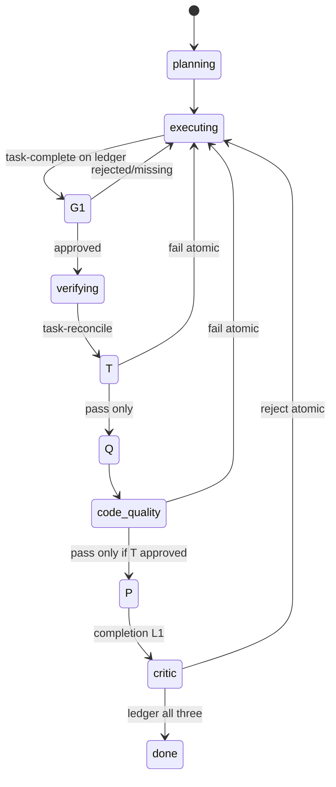

# 完成门禁（成绩单 + 两道验收 + 独立挑刺） - Plan

## Goal Capsule

- **Objective:** 堵住 OMS「口头说做完了」：G1/G2 强制机读成绩单；验收双关；结束前 L1 critic 签核（禁止主身份自签）；不过则原子打回执行。
- **Authority:** 本 Product Contract > ideation；只卡假装做完、不打扰中间步骤。
- **Open blockers:** 无。L2 真隔离 Deferred（KTD3）。
- **Depends on (product):** maturity 假绿修复宜并行；quality 关须含 diff 类证据。
- **Product Contract preservation:** R5/D2/Success 按独立审查修订（L1/L2 分层）；其余 R/A/F/AE 稳定。
- **Review:** 独立 agent GO-WITH-FIXES 已合入 Planning Contract（ledger / 写盘护栏 / reject 打回）。

---

## Product Contract

### Summary

用户使用 OMS 自动驾驶（尤其 `/oms:auto` 一类从目标到结束的会话）时，系统在两个关口强制「交作业」：

1. **执行 → 验收**：主 agent 必须提交「任务完成成绩单」，证明任务列表相对目标已收敛（允许明确声明的合理延期项，但须写明）。
2. **验收 → 结束**：先完成两道验收（任务对账 + 代码质量），再完成 **L1 挑刺签核**（禁止主执行身份自签 completion；要求 critic 协议）；通过才允许 `done`。真独立 OS/会话隔离为 **L2 后续**。

中间步骤不要求逐步成绩单。未通过则**禁止结束**，**原子回到 executing**，并注入失败理由清单。

### Problem Frame

- **Who:** 依赖 OMS 自主跑完任务的用户；维护者需要可信的「完成」语义。
- **What breaks:** Agent 自报完成；`done` 完成门存在「无 verification-state 文件则放行」的过渡期豁免，auto 路径可绕过；验收无强制双关。
- **Why now:** ideation 对照 workflow-cookbook 后最高杠杆是「完成门」；用户选择只抓假装做完。

### Requirements

- **R1. 只卡两道关口** — G1：`executing→verifying`；G2：`verifying→done`。中间步骤不强制成绩单。
- **R2. 成绩单可机读、可展示** — 结论 过/不过 + 人读摘要 + 证据列表；状态可查。
- **R3. 进入验收前任务完成成绩单** — 无单或不过则拒绝进入 verifying。
- **R4. 验收内两道关** — ① 任务对账 ② 代码质量；① 不过不启动 ②。
- **R5. 结束前挑刺签核（L1/L2）** — L1：禁止主身份自签 completion + critic 协议 + 无通过记录拒 done。L1 **不承诺**密码学会话隔离。L2 Deferred：真独立会话/nonce/teammate-only。
- **R6. 不过 → 原子打回 executing + 理由清单** — 无默认硬闯。
- **R7. 适用范围** — auto/`oms-start`；与 PRD completion 对齐不挖洞；G1 支持 tasks/PRD 矩阵。
- **R8. 可观测** — 关卡、ledger 摘要、lastGateFailure 可查。

### Non-Goals

- 逐步成绩单；用户默认审批；移植 Claude Workflow；五票陪审团；L2 真隔离（本期）；maturity 假绿修复本身。

### Actors

- A1 主执行 · A2 验收交单逻辑 · A3 挑刺角色（L1 协议） · A4 用户 · A5 OMS 运行时

### Key Flows

- F1 健康完成 · F2 任务未完拒验收 · F3 对账不过不跑质量关 · F4 挑刺 reject 原子打回 · F5 跳过签核拒 done

### Acceptance Examples

- AE1：未完成无 deferred / 空 tasks / 全 deferred → 拒 verifying  
- AE2：无 task-reconcile 时不得 code-quality 通过；乱序 submit 拒  
- AE3：无 completion 签核拒 done；仅 story 签核不得冒充 completion  
- AE4：材料协议白名单（本期 prompt/契约；runtime 哈希 L2）  
- AE5：reject 后 **stage=executing** + lastGateFailure  
- AE6：auto/goal/onStop/oms-start/team 文案无「无条件直接 done」  

### Success Criteria

- 无三闸机读通过时无法 `done`（堵**口头 done**，不堵恶意全流程伪造——写盘护栏缓解）  
- reject 路径 stage 必回 executing 且理由可查  
- 中间步骤无逐步成绩单摩擦  
- 文档诚实写清 L1/L2  

### Scope Boundaries

| In | Out |
| --- | --- |
| 两道关口 + ledger 多闸 | 逐步写文件门禁 |
| 验收顺序硬闸 | 五票陪审团 |
| L1 critic 协议 | L2 真隔离（Deferred） |
| reject 原子打回 | 默认硬闯 done |
| oms-state 写保护 | 第二套平行门禁 |
| 扩展 verification | 声称已保证独立 OS 会话 |

### Key Decisions (product)

| ID | Decision |
| --- | --- |
| D1 | 只抓假装做完（G1/G2） |
| D2 | 挑刺 L1 协议强制；L2 真隔离后续 |
| D3 | 验收 = 任务做没做完 → 代码靠不靠谱 |
| D4 | 失败原子打回并写清卡点 |
| D5 | 成绩单 / ledger 一等公民 |

### Assumptions

- L1 在 Snow 上只能强制协议与 id 规则，不能保证密码学身份；L2 真隔离见 Deferred。  
- 用户接受结束路径更慢更贵；本方案堵口头 done，不堵恶意写盘全流程自导自演（见 KTD8 缓解写盘旁路）。  

### Outstanding Questions（实现时）

- 极小 diff 是否以后加显式 quick 模式（默认不做）。  
- qa/plan 是否第二期同步强制（第一期 auto）。

### Sources

- Ideation HTML；workflow-cookbook 模式层；现有 verification / completion gate  
- 独立审查 2026-07-09（GO-WITH-FIXES → 已合入本修订）

---

## Planning Contract

### Summary

扩展现有 verification 签核（不另起平行系统）：**ledger 多闸共存**、**`gatesRequired` 唯一真相关闭豁免**、任务/验收/completion 成绩单、**reject 原子打回 executing**、**禁止写 oms-state 旁路**、文案全入口去「直接 done」。L1 堵口头假完工；L2 真独立会话 Deferred。

### Problem Frame (implementation)

- `hasMatchingApproval`：verification 文件不存在 → 放行（过渡期豁免）；auto 几乎不 request-verification。  
- 现网 **单文件单记录**（`requestVerification` 覆盖整文件）→ 不能直接堆「三闸同时 approved」。  
- `reviewerAgentId` 为自报字符串；executing 可写 `.snow/oms-state/`。  
- reject 保持 pending、不改 stage；多处 prompt 仍写「通过即 done」。

### Key Technical Decisions

- **KTD1. Ledger 多闸模型（拍板，禁止悬空）。**  
  新增 `verification-ledger.json`（或 store 内 map）：`Record<GateScope, GateEntry>`。  
  - `GateScope` = `story`（按 storyId 可另表）| `task-complete` | `task-reconcile` | `code-quality` | `completion`。  
  - 每个 entry：pending token 生命周期 **或** 已 approved 快照（含 scorecard 摘要、reviewerAgentId、resolvedAt）。  
  - **request 新 scope 不得抹掉其它 scope 的 approved。**  
  - `hasMatchingApproval(scope[, storyId])` 读 ledger；pending 槽可全局一个「当前 pending 指针」。  
  - 保留/迁移现有单文件 story+completion 路径：读时若仅有旧 `verification-state.json`，升级写入 ledger。  
  - 逻辑进 `store.ts`；MCP 只编排。

- **KTD2. `state.gatesRequired` 为唯一豁免开关。**  
  新 `createState` / `oms-start` 默认 `gatesRequired: true`。  
  裁决：`gatesRequired && !approved(scope) → false`（**文件缺失也 false**）。  
  不再用「文件是否存在」当豁免信号。老会话无该字段可按 false 兼容一版并文档说明。  
  `forceSetStage` **仅** `done→executing` 绕过 completion 检查；**不清空** ledger（回退后需重新 completion；是否 invalidate 其它闸：回退时 **invalidate `completion` + `code-quality`**，保留 task 闸除非 tasks 变更——写进实现注释与测试）。

- **KTD3. 挑刺 L1 / L2。**  
  - **L1：** completion（及 code-quality）`submit-approval` 拒绝 self ids（`main`、空、`executor`、与会话绑定的主 id）；要求 allowlist 前缀如 `oms_critic` / `oms_reviewer` / `team:`。  
  - **诚实边界：** L1 **不能**阻止主 agent 填 `reviewerAgentId=oms_critic` 却不 spawn；测试须记录此 residual risk；Product R5 已分层。  
  - **L2 Deferred：** nonce 仅 critic tool 结果可见、teammate-only submit、worktree。  
  - 不在 MCP 内嵌 LLM。

- **KTD4. Stage 硬闸 + 顺序硬闸。**  
  - `executing→verifying`：`task-complete` approved（及 G1 任务矩阵，见 KTD7）。  
  - `verifying→done`：`task-reconcile` + `code-quality` + `completion` **ledger 三者同时** approved。  
  - **顺序：** `request`/`submit` `code-quality` 时若无 `task-reconcile` approved → **MCP 拒绝**；onStop 只提示当前缺的下一闸。  
  - reject 任一强制闸：见 KTD9。

- **KTD5. 成绩单 schema 与 pass 一致性。**  
  `{ pass: boolean, summary: string, evidence: string[], taskIds?: string[], deferred?: {id, reason}[], diffStat?: string, testExitCode?: number }`  
  - `status=approved` 提交强制 `pass===true` 且 `summary` 非空、`evidence.length≥1`。  
  - `pass:false` 只能走 reject 路径。  
  - code-quality：`evidence` 或 `diffStat` 至少其一；若 verify 命令历史含 `||` 风险，成绩单可标 `degraded: true` 但仍须 diff 证据（与 maturity 假绿修复协同）。

- **KTD6. 可观测与全入口文案。**  
  onStop / onUserMessage / beforeToolCall verifying 提示 / oms-start 步骤 / auto / team 路径：**禁止无条件「直接 done」**。  
  注入：当前缺哪闸、`lastGateFailure`、下一步 MCP 调用；限长。

- **KTD7. G1 规则矩阵（tasks vs PRD）。**  
  | 会话形态 | 进入 verifying 条件 |  
  | --- | --- |  
  | 仅 tasks | `task-complete` approved |  
  | 仅 PRD（goal/Ralph） | 全部 story `passes` **或** 等价 story 成绩单齐全 |  
  | 两者都有 | **两者都要** |  
  | `tasks.length===0` 且无 PRD | **拒绝** task-complete（除非显式 `noTasksReason` 且 gates 策略允许——默认拒绝） |  
  | deferred | 每条未完成须非空理由；**禁止** 100% 任务 deferred 无 `noTasksReason` 级 goal 声明 |

- **KTD8. 保护 `.snow/oms-state/**` 写路径。**  
  `beforeToolCall`：在有活跃 OMS state 时，拦截 filesystem 写入目标落在 `.snow/oms-state/`（及绝对路径等价）的工具；terminal 高危不解析则 stderr 警告 + 文档「旁路 = 违规」。  
  目标：堵「手写 ledger 伪造 approved」。

- **KTD9. Reject → 原子打回 executing。**  
  `submit-approval` verdict=rejected（强制闸 scopes）时：**同一事务** 写 `lastGateFailure` + `setStage(executing)`（若当前 verifying/done）。  
  测试断言 stage 与 failure 结构，不只断言文件字段。  
  旧 completion 在 reject 后不得再放行 done。

- **KTD10. 第一期范围。** auto 全状态机 + goal/Ralph completion 不挖洞；qa/plan 二期；team onStop 文案纳入 U6。

### High-Level Technical Design



控制面：store ledger 裁决 + MCP stage 拒绝 + beforeToolCall 护栏。  
数据面：`verification-ledger.json` + `state.gatesRequired` / `lastGateFailure`。  
执行面：主 agent 交 task 闸；critic 协议交 completion（L1）。

### Alternatives Considered

| Approach | Why not |
| --- | --- |
| 单文件继续堆 scope | 覆盖写毁掉多闸（审查 Critical #1） |
| 全新 oms-gate 平行系统 | 与 PRD 双轨；用户否决 |
| 声称已保证独立 OS 会话 | Snow 做不到；改为 L1/L2 |
| MCP 内嵌 LLM 挑刺 | 架构越界 |

### Risks & Dependencies

| Risk | Mitigation |
| --- | --- |
| 填表假完工 / 伪 critic id | L1 黑名单 + 文档 residual；L2 Deferred |
| 写盘伪造 ledger | KTD8 beforeToolCall |
| 多闸 TTL 2h 串行过期 | done 前可 re-request 单闸；ledger 分 scope TTL 独立 |
| 关闭豁免破坏老脚本 | 无 gatesRequired 兼容 |
| 测试假绿 | code-quality 强制 diff 类证据 |
| 巨型 store/mcp 文件 | 新逻辑优先 store 模块化函数，MCP 瘦编排 |

### Review Integration Note

独立审查 2026-07-09：**GO-WITH-FIXES**。本修订已吸收 Critical #1–#5 与 Major 多闸/文案/G1 矩阵/顺序硬闸/pass 一致性/gatesRequired 唯一真相。Residual：L1 无法防「不 spawn 只填 oms_critic 字符串」——已写入 R5/KTD3/DoD。

### Implementation Units

### U1. Ledger 模型、gatesRequired、写盘护栏基底

- **Goal:** 多闸共存数据模型；新会话强制门禁；oms-state 写保护骨架。  
- **Requirements:** R2, R7, KTD1, KTD2, KTD8  
- **Dependencies:** none  
- **Files:** `src/state/store.ts`, `src/mcp-server.ts`, `hooks/before-tool-call.mjs`, `test/test-completion-gate.mjs`, `test/test-gate-scorecards.mjs`  
- **Approach:** 实现 ledger + 迁移旧 verification-state；`gatesRequired` 默认 true；`hasMatchingApproval` 新语义；beforeToolCall 拦 `.snow/oms-state/**`。  
- **Execution note:** 表征测试先锁「无文件放行」现状，再改新会话行为。  
- **Test scenarios:**  
  1. 新会话 gatesRequired、无 approval → 拒 done。  
  2. 连续批准 3 个 scope 后 ledger 三者仍 approved；re-request 一闸不抹其它。  
  3. 无 gatesRequired 老 fixture 兼容行为。  
  4. forceSetStage done→executing 成功且不误拦。  
  5. filesystem 写入 oms-state 路径被 beforeToolCall 拒绝。  
- **Verification:** 测试全绿；旧 PRD completion 路径仍通。

### U2. 任务完成闸 G1 + 矩阵

- **Goal:** executing→verifying 硬闸；空任务/deferred/PRD 矩阵。  
- **Requirements:** R1, R3, R6, AE1, KTD7  
- **Dependencies:** U1  
- **Files:** `src/state/store.ts`, `src/mcp-server.ts`, `hooks/on-stop.mjs`, `test/test-gate-scorecards.mjs`  
- **Approach:** task-complete scorecard 校验；拒绝空 tasks；deferred 规则；PRD-only / both 矩阵。  
- **Test scenarios:**  
  1. Covers AE1：未完成无 deferred → 拒 verifying。  
  2. 全部 complete → 可 verifying。  
  3. 部分 deferred 非空理由 → 可 verifying。  
  4. tasks=[] → 拒。  
  5. 100% deferred 无 goal 级声明 → 拒。  
  6. 仅 PRD 全 passes → 可 verifying（无 tasks）。  
  7. tasks+PRD 缺一侧 → 拒。  
- **Verification:** MCP 场景覆盖矩阵。

### U3. 验收双关顺序硬闸

- **Goal:** task-reconcile → code-quality；乱序拒绝；done 需两者。  
- **Requirements:** R4, AE2, KTD4, KTD5  
- **Dependencies:** U2  
- **Files:** `src/state/store.ts`, `src/mcp-server.ts`, `hooks/on-stop.mjs`, `test/test-gate-scorecards.mjs`  
- **Approach:** 无 reconcile 则拒 quality submit；approved 强制 pass+evidence；code-quality 身份规则与 completion 同级 L1（非 self id）。  
- **Test scenarios:**  
  1. Covers AE2：无 reconcile 时 quality request/submit 拒。  
  2. 仅 reconcile → 拒 done。  
  3. 两者齐无 completion → 拒 done。  
  4. approved 但 pass:false / 空 evidence → 拒。  
  5. reconcile reject → 原子 stage=executing，quality 不可仍为放行态。  
- **Verification:** 顺序与 schema 测试锁定。

### U4. Completion L1、reject 原子打回、self-id

- **Goal:** completion 签核 L1；reject 改 stage；残余风险文档化。  
- **Requirements:** R5, R6, AE3, AE4, AE5, KTD3, KTD9  
- **Dependencies:** U1, U3  
- **Files:** `src/state/store.ts`, `src/mcp-server.ts`, `hooks/on-stop.mjs`, `hooks/on-user-message.mjs`, `hooks/before-tool-call.mjs`, `assets/commands/oms/auto.json`, `test/test-completion-gate.mjs`  
- **Approach:** self-id 拒绝；reject→executing+lastGateFailure；expired completion 拒 done；注释 residual「伪 oms_critic 字符串」。  
- **Test scenarios:**  
  1. Covers AE3：缺 completion → 拒 done。  
  2. Covers AE5：reject 后 **stage===executing** + lastGateFailure。  
  3. self-id 黑名单 submit 失败。  
  4. 仅 story approved 冲 done → 拒。  
  5. completion expired → 拒。  
  6. （文档化）伪 critic 字符串若仍可通过：测试或注释标明 residual，不宣称 R5 强隔离。  
- **Verification:** 工具层 + stage 断言。

### U5. 可观测 get-state / 注入

- **Goal:** 关卡与失败可查。  
- **Requirements:** R2, R8, KTD6  
- **Dependencies:** U2（可与 U4 并行收尾）  
- **Files:** `src/mcp-server.ts`, `hooks/on-stop.mjs`, `hooks/on-user-message.mjs`, tests  
- **Approach:** get-state 打印 ledger 摘要、gatesRequired、lastGateFailure、当前建议下一闸。  
- **Test scenarios:** 失败后 get-state 含 summary；无会话不变。  
- **Verification:** 字符串断言。

### U6. 全入口文案与 PRD/goal 不挖洞

- **Goal:** 消灭「直接 done」诱导；goal/Ralph/team 对齐。  
- **Requirements:** R7, AE6, KTD6, KTD7, KTD10  
- **Dependencies:** U4, U5  
- **Files:** `README.md`, `assets/commands/oms/auto.json`, `goal.json`, `help.json`, `assets/skills/oms/ralph/SKILL.md`, `hooks/on-stop.mjs`, `hooks/on-user-message.mjs`, `hooks/before-tool-call.mjs`, `src/mcp-server.ts`（oms-start 步骤文案）, 契约 grep 测试  
- **Approach:** 大白话三关；契约测试 grep 关键路径不得出现无条件 done 诱导（allowlist 替换句）。  
- **Test scenarios:** Covers AE6 — auto/goal/onStop/oms-start 文案契约；team verifying 路径不直 done。  
- **Verification:** grep 契约 + 人工 README。

### Sequencing

```text
U1 → U2 → U3 → U4 → U5 → U6
```

### Verification Contract

- `npm test` 全绿。  
- 手工：`/oms:auto` — 无交单拒 verifying；矩阵边界；双关顺序；无 completion 拒 done；reject 打回；全过 done。  
- 对抗手工：尝试不 spawn 只填 oms_critic — 记录是否通过，对照 R5 L1 residual。  
- 回归：PRD goal 签核仍可结束。

### Definition of Done

- [ ] U1–U6 完成，R1–R8 有测试/契约（AE4 prompt-only 已标注）  
- [ ] 新会话无法靠无 verification 文件假 done  
- [ ] ledger 三闸可同时 approved 且可测  
- [ ] reject 后 stage=executing  
- [ ] oms-state 写路径受 hook 保护  
- [ ] 全入口文案无「无条件直接 done」  
- [ ] README 写明 L1/L2 与「堵口头 done、不堵恶意全流程」  

### Deferred to Follow-Up Work

- L2 真独立 critic（nonce / teammate-only submit / worktree）  
- qa/plan 强制同一门  
- 显式 quick 模式  
- GCF 配方（ideation #4）  
- maturity 假绿修复（计划 001）  
- runtime 材料白名单哈希（AE4 L2）

### Sources & Research

- `src/mcp-server.ts` completion gate ~L281–304  
- `src/state/store.ts` VerificationState / requestVerification 覆盖写 / hasMatchingApproval 豁免  
- `test/test-completion-gate.mjs`  
- 独立审查 agent 2026-07-09  
- External: workflow-cookbook 验证门模式（启发 only）
