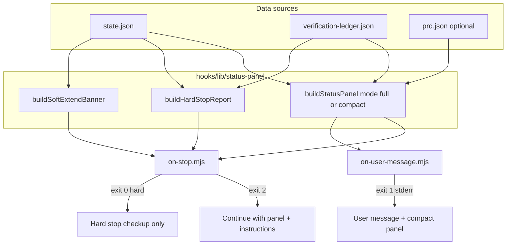

# 状态面板与诚实收口 - Plan

## Goal Capsule

- **Objective:** 让 OMS 自主会话「每轮都看得清、该停就老实说」：人与 AI 共用固定状态面板；软上限续命说清楚；硬上限强制停并交完整体检，不装成正常完成。
- **Authority:** 本 Product Contract > ideation Wave 2 排序；不改完成门业务规则，只改可见性与停机诚实度。
- **Open blockers:** 无。
- **Depends on (product):** 完成门 L1（ledger / lastGateFailure / gatesRequired）与 turn soft/hard 字段已存在。
- **Product Contract preservation:** Product Contract unchanged（planning 仅澄清实现切分；R/A/F/AE ID 稳定）。

---

## Product Contract

### Summary

用户依赖 `/oms:auto` 等自驾会话时，系统在 **onStop 续跑** 与 **onUserMessage 注入** 两处，展示**同一结构**的状态面板，使人与 AI 对齐「阶段 / 轮次 / 门 / 失败」。  
软上限仍自动延长配额，但文案必须标明「已续命」而非伪装成常规进度。  
硬上限到达时结束会话，并交付**完整体检**摘要，明确「撞硬顶停止」，不得表现为正常 `done`。

### Problem Frame

- **Who:** 跑 OMS 自驾的用户；续跑中的主 agent。
- **What breaks:** 进度信息散文化、分散；软上限 +10 容易被当成正常；硬停信息过薄，人难接手。
- **Why now:** 完成门已把「能不能 done」数据化，但每轮仍不一定看得见；Wave 2 用户选定「仪表盘 + 诚实刹车」优先于新配方。

### Requirements

- **R1. 双入口同一套字段模型** — `onStop` 与 `onUserMessage` 共用同一状态字段模型与键名顺序，不得两套互相矛盾的叙述。**呈现深度不同：**
  - **onStop（完整面板）：** R3 全量必选 + 条件行 + 本轮续跑指令。
  - **onUserMessage（缩略面板）：** 仅必选短行（见 R3 缩略集），减少刷屏；详细仍以 onStop 为准。
  - 单 agent 与 team 会话均适用（team 可多一行标识）。
- **R2. 面板主用户为「人 + AI」** — 完整面板主要服务续跑与深扫读；缩略面板服务用户插话时快速对齐。两者数据同源。
- **R3. 面板字段分必选 / 条件 / 缩略** —
  - **完整面板必选：** 目标摘要、当前 stage、任务完成度（完成/总数；未完成 id 列表可截断但须有数量）、轮次 `current / softCap / hardCap`、是否 `gatesRequired`、门状态行（关闭 / 已过哪些 / 仍缺哪些；无 ledger 时写「不适用」）、`lastGateFailure` 行（有摘要则写摘要，无则写「无」）。
  - **完整面板条件行（有数据才占位）：** 最近 verify/build/test 要点、PRD 进度要点、team 标识、本轮是否刚发生 soft 延长。
  - **缩略面板必选（onUserMessage）：** stage、轮次三元组、任务完成比、门仍缺/关闭、`lastGateFailure` 有无（无则「无」）；目标可截断一行。不强制展开任务 id 列表与 PRD 明细。
- **R4. 软上限续命保留且说清楚** — 越过 soft 时继续 +10 并持久化新 soft（现有策略保留）。**允许多次续命**（可反复 +10），直到触达 hard；每一次越过 soft 都必须单独标明延长事件。注入必须显式包含：发生了延长、旧 soft、新 soft、当前轮次、hard cap、离 hard 还多远。文案语义是 **配额续命事件**，禁止写成任务完成、阶段成功或「一切正常」。**本期不强制降速**。
- **R5. 硬上限强制停 + 完整体检** — `turnCount` 越过 hard 时：结束续跑循环（onStop 不再 exit-continue 推动）。输出完整体检至少含：目标、阶段、未完成任务列表、缺哪道门、最近门失败、verify/PRD 要点、建议下一步命令（如 `oms-stop`、新开 `/oms:goal`、`oms-get-state`）。某条件字段无可靠数据源时写 **未知/不可用**，禁止编造「已通过/全绿」。语义为 **hit hard ceiling / 强制停止**。**禁止**将 stage 标为 `done`、禁止写成正常完成收工。硬停后会话状态文件可保留供查看，**不**自动 `oms-stop` 清场。
- **R6. 可观测一致** — 面板与完整体检内容应与状态真相一致（与 state / ledger 可读字段同源）；不得编造已过门、已完成任务或 verify 结果。无数据则标明未知/无。
- **R7. 长度克制** — 面板有合理长度上限，优先完整控制信息；过长时压缩任务/PRD 明细，但不得丢掉 R3 必选行与「是否刚 soft 延长」。
- **R8. 兼容无门/老会话** — 无 `gatesRequired` 或无 ledger 时面板仍可用；无 PRD 时不假装有 PRD。

### Non-Goals

- 本期不做 journal / journal.jsonl 审计落盘。
- 不改完成门通过规则、scorecard schema、L2 critic 隔离。
- 不做软上限「强制降速」或「到 soft 就停」。
- 不新做 GCF、loop-until-dry、配方库、team 合并语义大改。
- 不要求本期必须重做 `oms-get-state` 打印格式（可选增强；非成功门槛）。

### Actors

- **A1 用户** — 扫面板理解进度；在硬停后接手。
- **A2 主 agent** — 靠面板续跑、交门、避免假 done。
- **A3 OMS 运行时（hooks）** — 组装面板、软延长、硬停。
- **A4 状态/ledger** — 面板数据源（只读消费既有字段）。

### Key Flows

- **F1 正常续跑** — 每轮 onStop：完整面板 + 阶段续跑指令；用户插话时 onUserMessage：缩略面板（同源字段）。
- **F2 软上限续命** — turn > soft：soft += 10，保存，面板/横幅标明延长事实，继续续跑。
- **F3 硬上限完整体检停** — turn > hard：不再续跑；输出完整体检；**不**自动改 stage=`done`、**不**自动清 state。
- **F4 门失败后仍看得清** — 存在 `lastGateFailure` 时面板固定露出摘要，直到运行时覆盖或清除该字段。

### Acceptance Examples

- **AE1:** 自驾中途看最新 **onStop 完整面板** 即可回答：stage、turn/soft/hard、任务还剩几条、是否还缺门。
- **AE2:** 触发软延长时，onStop 注入中出现「已延长」及旧/新 soft，且会话继续；不得被读成「任务完成」。允许多次延长直至 hard。
- **AE3:** 触发硬停时，会话不再被 hook 续跑；文案含完整体检字段；stage 仍非 `done`（除非用户先已合法 done）；缺数据可写未知。
- **AE4:** 无 PRD、无 gates 的会话：面板不崩溃、不谎称有门/有 PRD。
- **AE5:** onStop 完整面板与 onUserMessage 缩略面板字段模型一致；缩略为子集，不得矛盾。
- **AE6:** team 会话仍输出同构状态段；可多 team 条件行。

### Success Criteria

- 用户无需翻长对话即可定位「卡在哪 / 差什么 / 还剩多少轮」。
- 软延长不可被误读为「一切正常、无配额事件」。
- 硬停后用户能凭一份摘要决定下一步。
- 不引入与完成门 L1 冲突的「口头 done」旁路。
- **可测门槛：**
  - onStop 完整面板含 R3 全部必选行稳定标记。
  - onUserMessage 缩略含 R3 缩略必选行；与同 state 完整面板的 stage/轮次/门状态一致。
  - 软延长：旧/新 soft；exit continue。
  - 硬停：固定硬停标识 + 完整体检字段；不写 done 成功；无 verify 可写未知。

### Key Decisions

| ID | Decision | Rationale |
|----|----------|-----------|
| D1 | 软上限保留自动 +10，只强化说明 | 续命哲学；诚实 = 标注延长 |
| D2 | 硬上限才强制停 + 完整体检 | 「该停就老实说」落在 hard |
| D3 | 双入口同一字段模型；onStop 完整、onUserMessage 缩略 | 防矛盾又减刷屏 |
| D4 | 本期无 journal | 先把注入做对 |
| D5 | 本期不强制降速 | 用户选「只要说清楚」 |

### Scope Boundaries

| In | Out |
|----|-----|
| 状态面板（onStop 完整 + onUserMessage 缩略） | journal |
| 软延长透明文案（可多次） | soft 强制停 / 强制降速 |
| 硬停完整体检 | 完成门规则、L2、GCF |

### Assumptions

- Soft 默认 50、hard 默认 200、+10 步长保持现状。
- `lastGateFailure` 与 ledger 足以支撑门展示。
- Hook 注入通道可承载克制长度的面板文本。

---

## Planning Contract

### Summary

在 hook 层抽出**共享状态面板模块**，由 `on-stop.mjs` 输出完整面板 + 强化软延长/硬停文案，由 `on-user-message.mjs` 输出缩略面板；用现有 `test-iteration-limits.mjs` 模式（spawn hook + 断言 stderr）扩展覆盖。不改 MCP 完成门裁决逻辑。

### Key Technical Decisions

| ID | Decision | Rationale |
|----|----------|-----------|
| KTD1 | 新增 `hooks/lib/status-panel.mjs`（或并入 `oms-state.mjs` 导出的纯函数）统一渲染 | 保证 R1 同源；避免 onStop/onUserMessage 复制粘贴分叉 |
| KTD2 | 渲染输入 = `state` + 可选 `ledger` 摘要 + 可选 `prd` + `options{ mode: full\|compact, softExtend?, verifyNote? }` | 条件行有数据才出；无数据不编造 |
| KTD3 | 门状态：hooks 侧只读 `verification-ledger.json`（若存在）+ `state.gatesRequired` + `state.lastGateFailure` | 与完成门 L1 同源；hooks 已有 state dir 约定 |
| KTD4 | 稳定行标记用固定标题前缀（如 `[OMS:STATUS]` 块内 `Stage:` / `Turns:` / `Gates:` / `LastGateFailure:`） | 测试可断言；人机可扫 |
| KTD5 | 硬停消息用 `[OMS:HARD STOP]` + 完整体检段；**不**调用 `forceSetStage(done)`、**不**清 state | 满足 R5/AE3；对齐现有 hard exit 0 |
| KTD6 | 软延长文案升级为显式「配额续命」：旧 soft、新 soft、current、hard、距 hard 剩余；保留 +10 与 exit 2 | 满足 R4/AE2；行为兼容 `test-iteration-limits` |
| KTD7 | onStop 组装顺序：`[STATUS full]` → 可选 soft 横幅 → 现有 `buildContinuationPrompt` 指令段 | 状态与指令分段，避免两套矛盾叙述 |
| KTD8 | 本期不写 `hitHardCeiling` 状态字段（可选后续）；硬停仅输出文本 | 产品 Outstanding 非必选；减少 store 面 |

### High-Level Technical Design

### Implementation Units

### U1. 共享状态面板渲染库

- **Goal:** 单一模块生成 full / compact 面板字符串与硬停完整体检 / 软延长横幅。
- **Requirements:** R1–R3, R6–R8, AE4, AE5, AE6
- **Dependencies:** 无
- **Files:**
  - create: `hooks/lib/status-panel.mjs`
  - modify: `hooks/lib/oms-state.mjs`（仅当需共享读 ledger 小助手时）
  - test: `test/test-status-panel.mjs`
- **Approach:**
  - 导出 `buildStatusPanel(ctx, { mode })`、`buildSoftExtendBanner(...)`、`buildHardStopReport(ctx)`。
  - `ctx` 含 state、可选 ledger 条目 map、可选 prd、可选 verifyNote、team 标识、softExtend 事件。
  - 固定行标签便于断言；任务列表与 goal 截断策略集中在此。
  - 无 ledger / 无 gatesRequired：Gates 行写关闭或不适用，不抛错。
- **Patterns to follow:** `hooks/lib/oms-state.mjs` 的防御性 `Array.isArray`；`buildPrdSection` 风格。
- **Test scenarios:**
  - Covers AE4. 无 tasks/无 ledger/无 prd → full 面板含必选行且不谎称有门/PRD。
  - Covers AE5. 同 ctx 下 full 与 compact 的 stage/turns/gates/lastFailure 语义一致，compact 更短。
  - Covers AE6. `teamName` 存在时 full 出现 team 条件行。
  - `lastGateFailure` 有值时两模式均出现摘要；无值时出现「无」。
  - 长 goal/tasks 被截断但不丢 Turns/Gates 行。
- **Verification:** `node test/test-status-panel.mjs` 通过。

### U2. onStop 接入完整面板 + 软延长/硬停诚实文案

- **Goal:** 续跑每轮带完整状态；软延长说清；硬停交完整体检且不伪 done。
- **Requirements:** R1, R3–R7, F1–F3, AE1–AE3
- **Dependencies:** U1
- **Files:**
  - modify: `hooks/on-stop.mjs`
  - modify: `test/test-iteration-limits.mjs`
  - test: `test/test-status-panel.mjs`（若集成测放这里则扩展）或 `test/test-hooks.mjs` 补充
- **Approach:**
  - 在 turn 自增与 cap 检查路径上：hard 分支调用 `buildHardStopReport` 替换单薄 HARD STOP 文案；**不**改 stage。
  - soft 分支：保留 +10 + saveState；`buildSoftExtendBanner` 必须含旧/新 soft 与 hard 距离；禁止「任务完成」语义。
  - 正常 continue：`statusPanel full` + 既有 `buildContinuationPrompt`（可逐步去掉 prompt 内重复的 turn/goal 冗余，但门/指令保留）。
  - 组装 ledger：读 state dir 下 `verification-ledger.json`（失败则空）；verifyNote 若本轮 `runVerification` 有结果可传入，否则未知。
- **Execution note:** 先扩 soft/hard fixture 断言（现有 spawn 模式），再改 hook，保持 exit 码语义不变（soft=2, hard=0）。
- **Patterns to follow:** `test/test-iteration-limits.mjs` 的 `runOnStop`；现有 soft/hard 分支结构。
- **Test scenarios:**
  - Covers AE2. soft：exit 2；含旧 soft/新 soft；含续命语义标记；可多次（第二次 soft 再延长仍标注）。
  - Covers AE3. hard：exit 0；含 `[OMS:HARD STOP]` + 完整体检字段；输出不含「done 成功」；stage 文件仍非 done。
  - Covers AE1. 正常 executing continue：stderr 含完整面板必选标记。
  - hard 无 verify 数据：出现「未知」或等价字样，不出现虚假 passed。
- **Verification:** `node test/test-iteration-limits.mjs` 与相关 hook 测试通过；手动扫一眼 stderr 可读。

### U3. onUserMessage 接入缩略面板

- **Goal:** 用户插话时看到缩略状态，与 onStop 同源不矛盾。
- **Requirements:** R1–R3, R7–R8, F1, AE5, AE6
- **Dependencies:** U1
- **Files:**
  - modify: `hooks/on-user-message.mjs`
  - test: `test/test-status-panel.mjs` 或 `test/test-hooks.mjs` / 新 `test/test-on-user-message-panel.mjs`
- **Approach:**
  - 在现有 stage prompt 前（或替换重复 goal/stage 行）注入 `buildStatusPanel(..., { mode: 'compact' })`。
  - 无 active state 时行为不变（exit 0）。
  - 保持 exit 1 注入语义。
- **Patterns to follow:** 现有 `getStagePrompt` 结构；spawn 测试模式同 hooks 测试。
- **Test scenarios:**
  - Covers AE5. 同 state compact 输出含缩略必选行；stage/turns 与 full 一致。
  - 无 state：不注入面板、exit 0。
  - gatesRequired false：门行关闭/不适用，不崩溃。
- **Verification:** 对应用户消息 hook 测试通过。

### U4. 文档与 package 测试入口（若需要）

- **Goal:** README/help 如有「轮次/硬停」描述与行为一致；npm test 包含新测试文件。
- **Requirements:** Success Criteria 可测门槛；非功能文档诚实
- **Dependencies:** U2, U3
- **Files:**
  - modify: `package.json`（`test` script 串联新文件）
  - modify: `README.md`（仅当现有文案与硬停/软延长不符时最小更新）
  - test: 已有测试文件
- **Approach:** 文档只补「软延长可多次、硬停完整体检、面板在 hook 注入」一句级说明；不扩配方。
- **Test expectation:** none — 配置/文档；行为由 U1–U3 覆盖。
- **Verification:** `npm test` 全绿。

---

## Verification Contract

| Gate | Proof |
|------|--------|
| 单元 | `test/test-status-panel.mjs`：full/compact/hard/soft banner 字符串契约 |
| 集成 | `test/test-iteration-limits.mjs`（及 onUserMessage spawn 测）：exit 码 + 文案标记 |
| 回归 | 现有 `test/test-hooks.mjs`、`test/test-gate-scorecards.mjs` 仍绿（不改门裁决） |
| 产品 | AE1–AE6 均可映射到上述断言；硬停后 state 仍可读 |

## Definition of Done

- [ ] U1–U3 行为符合 R1–R8 与可测门槛
- [ ] 软延长：可多次、文案含旧/新 soft、exit 2
- [ ] 硬停：完整体检、exit 0、不伪 done、不清 state
- [ ] onStop 完整 / onUserMessage 缩略同源
- [ ] `npm test` 通过
- [ ] 无 journal、无完成门规则变更

## Risks & Dependencies

| Risk | Mitigation |
|------|------------|
| 面板过长挤占上下文 | R7 截断策略集中在 status-panel；优先丢任务明细 |
| ledger 读路径与 MCP 不一致 | 与 `src/state/gates.ts` 同文件名 `verification-ledger.json`；缺文件当空 |
| soft 文案变更导致旧断言碎 | 同步更新 `test-iteration-limits` 期望字符串 |
| onUserMessage 注入过吵 | 已用 compact 子集（产品 D3） |

### Deferred to Follow-Up Work

- `oms-get-state` 打印与面板同构
- 可选 `hitHardCeiling` / `stoppedReason` 状态字段
- journal.jsonl
- 软上限降速策略

## System-Wide Impact

- **Hooks only：** 不改 stage 机转移条件；完成门仍由 MCP 裁决。
- **用户可见：** 每轮/插话注入变长但仍结构化；硬停信息更可操作。
- **Team：** 同构面板 + 可选 team 行；不改 team 合并协议。
