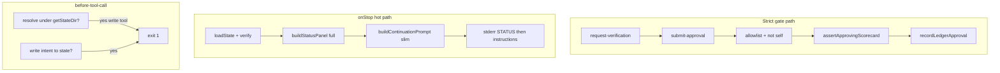

# fix: 完成门与状态热路径负优化修复 - Plan

## Goal Capsule

- **Objective:** 消除审查发现的负优化：严格门禁可被假身份自签、self 匹配误伤、每轮上下文叠床架屋、ledger 重复读盘、控制面路径拦截过杀、code-quality 证据可嘴炮过关——在不推翻完成门与状态面板产品契约的前提下把「假加固 / 越改越贵」改回真约束与可控成本。
- **Authority:** 本 Product Contract > 审查 finding 优先级（P1 门禁 > P2 上下文/路径/scorecard）；状态面板字段模型以 `docs/plans/2026-07-09-003-feat-status-panel-honest-stop-plan.md` 为准，本计划只消重、不拆面板产品职责。
- **Open blockers:** 无。
- **Depends on:** 已合并在本地 main 的完成门 ledger 与状态面板实现（`src/state/gates.ts`、`hooks/lib/status-panel.mjs`、`hooks/on-stop.mjs` 等）。
- **Product Contract preservation:** 无上游 brainstorm；本计划自举 Product Contract。

---

## Product Contract

### Summary

针对「完成门 + 状态面板」四提交落地后的负优化审查结论，修复六类已确认问题：严格 reviewer 身份可被 `team:*` 架空、self id 规则过宽、onStop 面板与续跑指令重复塞上下文、done 门检重复读 ledger、before-tool-call 控制面拦截误伤、code-quality scorecard 可用关键词假过。**不**改门的数量与顺序，**不**取消每轮状态可见性，**不**借机做 hooks/MCP 大重构。

### Problem Frame

- **Who:** 跑 OMS 自驾的用户与主 agent；依赖严格门禁的会话安全。
- **What breaks:**
  - 门禁「看起来更严」但 `team:executor` 等 id 仍可通过严格审批（假加固）。
  - `startsWith('main')` 把 `maintainability*` 等合法字符串标成 self（埋雷）。
  - 每轮 STATUS + 续跑文案双份 Goal/任务，token 与注意力随回合上涨（产品体验负优化）。
  - 路径/终端子串拦截误拦文档与只读命令。
  - code-quality 证据层可口嗨过关。
- **Why now:** 问题已在本地相对 `origin/main` 的 4 个提交上坐实，且测试基线全绿，适合做小步加固而非另起炉灶。

### Requirements

- R1. **严格 reviewer 不可被裸 `team:` 自签** — `isAllowlistedStrictReviewer` 不得因任意 `team:` 前缀放行；`team:executor` / `team:self` / `team:main` 等必须失败；合法 id 仍为 allowlist 上的 critic/reviewer/architect 形态（含 `#` 前缀与 `-`/`_` 后缀变体，与现有意图一致）。
- R2. **self 识别不得误伤无关 id** — `isSelfReviewerId` 对精确 self 集合仍拦截；**禁止**裸 `startsWith('main')` 导致 `maintainability` / `mainline` 被当 self；允许有界前缀如 `main-` / `executor-`（若实现选择保留「前缀 self」语义）。
- R3. **code-quality 批准必须有实质 diff 痕迹** — 批准路径要求非空 `diffStat`（或与现有 schema 等价的硬字段），不得仅靠 evidence 字符串命中 `build`/`npm test` 等词通过。
- R4. **done 门检单次读 ledger** — `canEnterDone`（及同函数内错误摘要所需 ledger 视图）对磁盘 ledger 的加载次数为一次语义读，不因三个 scope 各调一次 `getLedgerApproval` 而三次 `loadLedger`。
- R5. **控制面写保护锚定 state 目录** — 文件写工具仅拦截解析后落在 OMS state 目录下的路径，以及该目录下的 ledger/state 文件名；不得因路径任意子串含 `verification-ledger` / `oms-state` 而拦截仓库其它位置的文档或示例。
- R6. **终端拦截区分写与只读意图** — 对终端工具：仅当命令呈现对 state 目录或 ledger 文件的写/删/重定向意图时拦截；纯读（如 `type`/`cat`/`rg`/`git show` 查看）默认放行，除非命令同时带写重定向到 state 路径。
- R7. **消除 onStop 面板与续跑指令的重复叙事** — 保留 onStop 完整面板（003 计划 R1/R3：人+AI 每轮可读控制信息）；**续跑指令不再完整复述**已由面板给出的 Goal 全文、任务清单表、轮次三元组等。面板仍是控制真相源；指令侧重「本阶段该做什么」。
- R8. **回归可测** — 每个 R 至少有一条自动化断言；`npm test` 全绿为落地门槛。
- R9. **兼容** — 不改变门顺序（task-complete → verifying；task-reconcile → code-quality → completion → done）；不关闭 `gatesRequired` 默认；不把硬停改回伪 done。

### Non-Goals

- 不引入 teammate 注册表或动态 team id 白名单（本期直接收紧 `team:`）。
- 不把 hooks 与 MCP 的 ledger 失效逻辑合并成共享包（审查 #6 双实现漂移延后）。
- 不改 soft/hard 续命策略、不取消每轮 onStop 面板注入。
- 不重做 `oms-get-state` UI、不新做 journal。
- 不做 P3 文案微调级「软延长横幅与 Turns 行略重叠」除非实现时零成本顺手。

### Actors

- A1 主 agent — 交门、被 hook 注入面板与指令。
- A2 独立 critic/reviewer — 严格门签批。
- A3 OMS hooks / MCP — 执行拦截与状态展示。
- A4 用户 — 靠面板扫进度；不应因误拦无法读日志。

### Key Flows

- F1 严格门签批 — request-verification → submit-approval(scorecard + allowlisted id) → ledger 记入；非法 id 或弱 scorecard 被拒。
- F2 自驾续跑 — onStop：STATUS 面板 +（去重后）阶段指令；exit-2 继续。
- F3 写旁路防护 — 尝试写 state 目录 / 写 ledger → 拦；写/读仓库其它路径含同名文档 → 放行。

### Acceptance Examples

- AE1: `submitApproval(..., reviewerAgentId: 'team:executor', ...)` 对 completion/code-quality 返回 forbidden；`oms_critic` 在合法 scorecard 下仍可通过。
- AE2: `isSelfReviewerId('maintainability') === false`；`isSelfReviewerId('main') === true`。
- AE3: code-quality 仅有 evidence `['npm test passed']` 且无 diffStat → 不可批准；带非空 diffStat → 可批准。
- AE4: 写 `docs/notes/verification-ledger-design.md` 不被 before-tool-call 拦截；写 `.snow/oms-state/verification-ledger.json` 被拦截。
- AE5: 同 state 下 onStop 注入中，Goal/任务列表不在「面板 + 续跑指令」两段各完整出现一遍（允许指令中出现「见 STATUS」式短引用）。
- AE6: 现有完成门与状态面板测试仍绿；新增负优化回归用例进现有 test 文件或同目录新文件并由 `npm test` 覆盖。

### Success Criteria

- 严格门禁不能被 trivially 自签（AE1）。
- 上下文每轮重复成本明显下降（AE5，可用字符串/结构断言，不要求精确 token 数）。
- 控制面防护误伤面收敛（AE4）。
- `npm test` 全绿。

---

## Planning Contract

### Assumptions

- 本期不需要真实 multi-agent team 用 `team:<name>` 签严格门；若未来需要，另开「注册 teammate allowlist」计划。
- 003 状态面板计划的「完整面板必选字段」仍有效；本计划通过**去重续跑指令**消负优化，而不是砍掉面板字段导致人读不全。
- `getStateDir()` 在 hooks 与 MCP 语义一致，可作路径锚定源。
- 审查所列 P3（横幅与 Turns 略重叠、TTL 双常量）默认可延后。

### Key Technical Decisions

| ID | Decision | Rationale |
|----|----------|-----------|
| KTD1 | 严格 allowlist **删除**裸 `team:` 通配；仅保留 `oms_critic` / `oms_reviewer` / `oms_architect` 及 `#` 前缀与 `-`/`_` 后缀变体 | 关闭 AE1 自签洞；team 注册表成本高，非本期 |
| KTD2 | self：精确集合 + 可选 `main-`/`executor-` **有界前缀**；禁止裸 `startsWith('main')` | 修 maintainability 误伤，保留 main-agent 类 id 语义 |
| KTD3 | code-quality：`assertApprovingScorecard` 要求 `diffStat` 非空；去掉/降级「evidence 含 build/test 词即可」旁路 | 防嘴炮；diffStat 已在 schema 中 |
| KTD4 | `canEnterDone` 一次 `loadLedger()`，内存判三门；失败摘要复用同次结果 | 热路径正确性等价、IO 更干净 |
| KTD5 | 路径保护：规范化后 `path.resolve` 落在 `getStateDir()` 前缀下才拦；文件名精确匹配仅作为「相对路径写 ledger」补充 | 消 AE4 误伤 |
| KTD6 | 终端：在「命中 state 路径」前提下再要求写类算子（`>`/`>>`/set-content/rm/del 等）；只读查看放行 | 防旁路写，不挡排障读 |
| KTD7 | onStop 去重策略：**改续跑 prompt，不砍面板 R3 字段** — `buildContinuationPrompt` 在已有 STATUS 的路径上省略 Goal 复述、任务全表、轮次进度头中的冗余块；阶段操作步骤保留 | 对齐 003 产品契约 + 审查 #3 |
| KTD8 | 测试落点：优先**扩展已在 `package.json` `scripts.test` 链中的文件**（`test-gate-scorecards.mjs`、`test-status-panel.mjs`）。若新建 `test/test-*.mjs` 或 `hooks/lib/oms-path-guard.mjs` 的单测文件，**必须**同步把该文件追加进 `package.json` 的 `test` 脚本链，否则 `npm test` 不会跑到 | 本仓库测试是显式 `node test/...` 串联，非 glob 发现 |

### High-Level Technical Design

### Alternatives Considered

| Approach | Why not chosen |
|----------|----------------|
| 砍掉每轮 full STATUS，改为 N 轮一次 | 与 003 R1/AE1 冲突；人扫进度能力回退 |
| `team:` 改为「任意非 self」 | 仍易自签；假加固依旧 |
| code-quality 由宿主注入真实 git diff | 更强但跨进程契约大；本期先强制客户端填 diffStat |
| 路径继续用宽松 includes | 实现简单但误伤已证实为负优化 |

### Scope Boundaries

#### In scope

- R1–R9 对应代码与测试。

#### Deferred to Follow-Up Work

- hooks `forceSetStage` 与 MCP `invalidatePostDoneGates` 抽取共享实现 / 原子写对齐（审查 #6）。
- teammate 注册表驱动的 `team:<id>` 严格签批。
- LEDGER_TTL 单源导出避免双常量漂移（P3）。
- soft 横幅与 Turns 行文案再压缩（P3）。

#### Out of scope

- 改门顺序、取消 gatesRequired、软硬上限策略变更。

### Risks & Dependencies

| Risk | Mitigation |
|------|------------|
| 收紧 allowlist 后真实 team 会话无法签严格门 | 文档与错误信息指向 `oms_critic`/`oms_reviewer`；team 签批另案 |
| 续跑 prompt 去重过度导致 agent 丢目标 | 面板保留 Goal 摘要；指令可保留「Goal 见 STATUS」一行 |
| 路径 resolve 在 Windows 大小写/斜杠不一致 | 统一 lower + 正斜杠规范化后前缀比较；测 UNC/相对路径样例 |
| diffStat 强制后老脚本缺字段 | 错误信息明确要求 scorecard.diffStat；测试覆盖错误路径 |

### Sequencing

1. U1 身份规则（P1，无依赖）
2. U2 scorecard 硬约束（P2，可与 U1 并行）
3. U3 ledger 单读（P2，小，可跟 U1 同 PR）
4. U4 路径/终端守卫（P2，独立）
5. U5 onStop 去重（P2，依赖面板已稳定；不依赖 U1–U4）

建议落地顺序：**U1 → U2 → U3 → U4 → U5**（或 U1+U2+U3 一提交，U4/U5 各一提交）。

---

## Implementation Units

### U1. 收紧严格身份：self + allowlist

**Goal:** 堵住 `team:*` 自签；修正 `main` 前缀误伤。  
**Requirements:** R1, R2, R8, R9  
**Dependencies:** 无  
**Files:**
- modify: `src/state/gates.ts` (`isSelfReviewerId`, `isAllowlistedStrictReviewer`)
- modify: `test/test-gate-scorecards.mjs`（优先扩展；若另建 `test/test-gate-identity.mjs` 则必须改 `package.json` `scripts.test` 串入）
- modify: `src/mcp-server.ts` 仅当错误提示仍写「team 可签」时同步文案
- modify (if new test file): `package.json`  

**Approach:**
- self：精确集合保留；若保留前缀，仅 `main-`/`executor-`（或等价边界），**禁止** `n.startsWith('main')` 无分隔符。
- allowlist：删除 `n.startsWith('team:')` 分支；保留 oms_*/#oms_* 精确与 `-`/`_` 后缀规则。
- 单测：`team:executor` / `team:self` 不允许；`oms_critic` / `#oms_reviewer-1` 允许；`maintainability` 非 self。

**Patterns to follow:** 现有 `test/test-gate-scorecards.mjs` 的 store 加载与 `ok()` 风格。  
**Test scenarios:**
- Happy: `oms_critic` allow true；`main` self true。
- Edge: `maintainability` self false；`main-agent` 若采用 `main-` 前缀则为 self true。
- Error: `team:executor` allow false；`bot-reviewer` allow false。
- Integration: `submitApproval` 对 completion + `team:executor` → `forbidden`（可在 store 层测）。

**Verification:** 身份相关断言全绿；不影响 task-complete self-gate。

---

### U2. code-quality scorecard 强制 diffStat

**Goal:** 去掉 evidence 关键词旁路，强制实质 diff 痕迹字段。  
**Requirements:** R3, R8  
**Dependencies:** 无（可与 U1 并行）  
**Files:**
- modify: `src/state/gates.ts` (`assertApprovingScorecard`)
- modify: `test/test-gate-scorecards.mjs`
- modify: `src/mcp-server.ts` 仅当工具描述/错误串仍暗示「evidence 含 diff 词即可」时同步  

**Approach:**
- 对 `scope === 'code-quality'`：要求 `diffStat` trim 后非空；evidence 数组仍要非空或与全局 evidence 规则一致（可保留 summary/evidence 基线）。
- 删除或不再单独使用「evidence 正则匹配 build/test」作为充分条件。
- completion 范围是否同步加强：本期 **仅 code-quality**（审查 finding 点名处）；completion 维持现有 evidence 规则以免扩大产品面。

**Test scenarios:**
- Happy: `{pass, summary, evidence:['reviewed'], diffStat:'1 file changed'}` 通过 assert。
- Error: 无 diffStat、仅 evidence `npm test ok` → throw/forbidden。
- Edge: diffStat 仅空白 → 失败。

**Verification:** 旧的「带 diffStat 的 approve」路径仍绿；新负例失败。

---

### U3. canEnterDone 单次 loadLedger

**Goal:** 消除三门检查的重复读盘。  
**Requirements:** R4, R8  
**Dependencies:** 无  
**Files:**
- modify: `src/state/gates.ts` (`canEnterDone`；必要时抽取内部 `getLedgerApprovalFrom(ledger, …)` 以免破坏 `getLedgerApproval` 对外 API)
- modify: `test/test-gate-scorecards.mjs`（行为回归：缺门文案不变）

**Approach:**
- `canEnterDone` 顶部一次 `loadLedger()`。
- 对 task-reconcile / code-quality / completion 在内存中做 TTL/status/scorecard 校验（复用与 `getLedgerApproval` 相同规则，避免双逻辑）。
- `formatLedgerSummary` 若在失败路径调用，优先复用已加载 ledger，或接受「失败路径多一次」但成功路径与主循环为一次——**优先失败路径也复用**。

**Test scenarios:**
- Happy: 三门齐全 → ok。
- Error: 缺一门 → reason 仍点名 missing scopes。
- Edge: 有 entry 但 scorecard.pass 非 true → invalid 类 reason（与现逻辑一致）。

**Verification:** 门检行为与改前一致；实现上无循环 `getLedgerApproval` 三次读文件（可用 code review / 可选 spy，不强制 mock fs）。

---

### U4. 控制面路径与终端写保护收窄

**Goal:** 只拦对 OMS state 的写旁路，不拦同名文档与只读。  
**Requirements:** R5, R6, R8  
**Dependencies:** 无  
**Files:**
- modify: `hooks/before-tool-call.mjs`
- create (recommended): `hooks/lib/oms-path-guard.mjs` — 纯函数 `isOmsStateWritePath(path, stateDir)`、`isOmsStateWriteCommand(cmd, stateDir)` 便于单测
- create or modify: `test/test-oms-path-guard.mjs`（或并入已挂入的 hooks 测试文件）
- modify (if new test file): `package.json` `scripts.test`

**Approach:**
- 以 `getStateDir()` 解析绝对路径为根；候选路径 `path.resolve(process.cwd(), p)` 后判断是否等于根或在根下。
- 去掉全局 `includes('verification-ledger')` / 裸 `oms-state/` 子串作为唯一条件。
- 终端：先解析命令字符串是否指向 state 路径，再要求写意图算子；避免 `rg verification-ledger` 被拦。
- Windows：统一分隔符与 lower-case 比较。

**Patterns to follow:** 现有 before-tool-call 的 FILE_WRITE_TOOLS / TERMINAL_TOOLS 集合与 fail-open catch。  
**Test scenarios:**
- Happy block: path `.snow/oms-state/state.json` 或绝对 stateDir 下 ledger → true。
- Happy allow: `docs/foo/verification-ledger-design.md` → false。
- Terminal block: `echo x > .snow/oms-state/verification-ledger.json` → true。
- Terminal allow: `type .snow/oms-state/verification-ledger.json` 或 `rg verification-ledger docs` → false。
- Edge: 相对路径 `../` 逃逸后仍落在 stateDir 则拦；落在外则放行。

**Verification:** 单元测守卫函数 + 若有 before-tool-call 集成测则补一条；全套 `npm test` 绿。

---

### U5. onStop 续跑指令与 STATUS 去重

**Goal:** 降低每轮上下文重复，保留完整面板可读性。  
**Requirements:** R7, R8  
**Dependencies:** 无（逻辑独立；建议在 U1–U4 之后合，便于回滚）  
**Files:**
- modify: `hooks/on-stop.mjs` (`buildContinuationPrompt` 与 main 组装顺序)
- modify: `hooks/lib/status-panel.mjs` 仅当需要导出「面板已含字段」标记或辅助时
- modify: `test/test-status-panel.mjs` 及若有 on-stop 契约测试则扩展

**Approach (KTD7):**
- 保持 `buildStatusPanel(..., {mode:'full'})` 字段符合 003 R3。
- 调整 `buildContinuationPrompt`：在 planning/executing/verifying 等分支中，**不再**用大段重复 Goal 与完整任务 checkbox 列表（若面板已含 Goal 摘要与 OpenTasks/Tasks 计数）；改为短引用 + **阶段动作清单**（set-stage、交门步骤等保留，这是面板没有的指令）。
- soft 延长横幅与 hard stop 报告不在本期大改。
- onUserMessage compact 面板已较短，**默认不改**，除非发现与 user 原文严重重复（非本期必须）。

**Test scenarios:**
- Happy: 给定 state，组装「模拟 onStop 输出」时 STATUS 含 `[OMS:STATUS]`，continuation 段不含第二份完整 `Tasks (n/m):` 任务表（或长度/重复行断言）。
- Edge: team 模式指令仍含 spawn/merge 操作步骤。
- Regression: verifying 分支仍明确三道门与 blocked oral done。

**Verification:** 面板单测仍绿；去重断言通过；手动扫一眼执行中文案仍可读。

---

## Verification Contract

- **Primary:** 仓库 `npm test`（`package.json` 显式串联的全部 `node test/*.mjs`；含 gate scorecards、status panel、hooks、mcp 等）。
- **Targeted:** 本计划新增/扩展的 gate identity、scorecard、path-guard、status 去重用例；凡新建测试文件必先挂入 `scripts.test`。
- **Manual smoke (optional):** 开短会话：尝试用假 `team:executor` 批 completion 应失败；写文档文件名含 ledger 应成功；onStop 注入扫一眼无双份任务表。

---

## Definition of Done

- R1–R9 均有对应实现或明确测试证明。
- U1–U5 完成；Deferred 项未混入本次提交。
- `npm test` 全绿。
- 无新增「假加固」旁路（至少 AE1/AE3/AE4 覆盖）。
- 文档：若 README/`/oms:help` 仍写 team 可签严格门或 evidence 关键词即可，需同步一句（最小文案）。

---

## System-Wide Impact

- **Security/fidelity:** 严格门从「仪式」回到「约束」。
- **Agent UX:** 每轮上下文更短，指令更聚焦动作。
- **Ops:** 无新服务；无迁移；旧会话 `gatesRequired` 行为不变。
- **Follow-up:** team 注册 allowlist、hooks/MCP ledger 写路径统一。

---

## Sources & Research

- 会话内 code review：`main` 超前 `origin/main` 4 提交负优化审查（findings #1–#7）。
- 产品约束：`docs/plans/2026-07-09-003-feat-status-panel-honest-stop-plan.md`（面板字段不得因去重被砍掉）。
- 完成门落地：`docs/plans/2026-07-09-002-feat-completion-gates-plan.md`（门顺序与 ledger 语义保持）。
- 本地实现：`src/state/gates.ts`、`hooks/before-tool-call.mjs`、`hooks/on-stop.mjs`、`hooks/lib/status-panel.mjs`、`test/test-gate-scorecards.mjs`。
- 外部调研：未做（纯本地回归加固，模式已在仓库内）。
