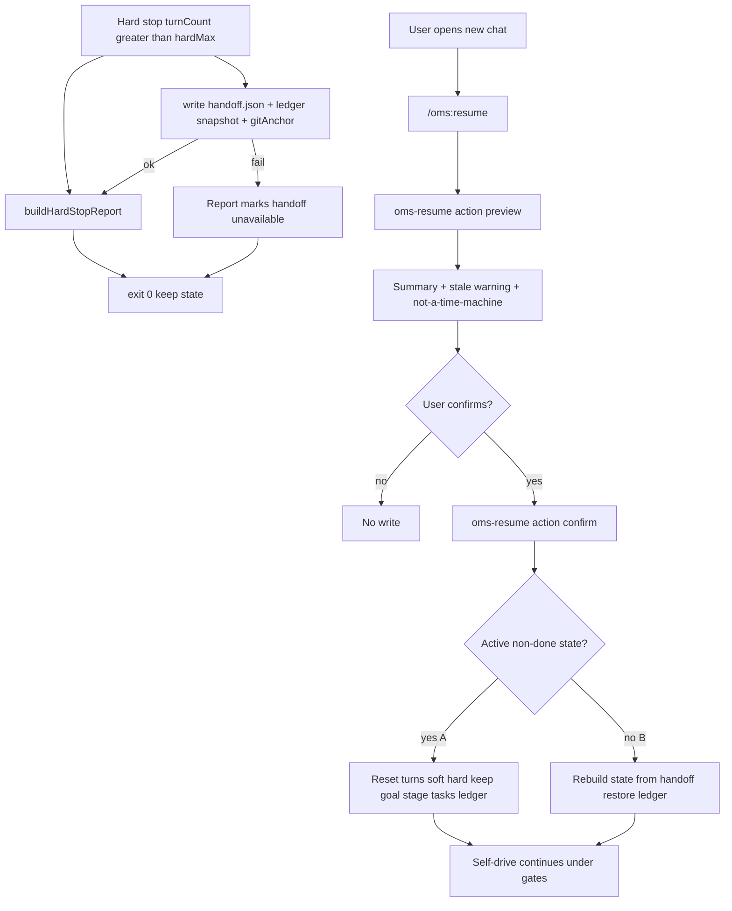

# 硬停交接包与确认后续跑 - Plan

## Goal Capsule

- **Objective:** 硬上限撞停后留下可机器读取的交班夹；用户在新会话中先审摘要、确认后，再恢复目标/阶段/任务与完成门 ledger，继续自驾——不把撞顶当成正常 done，也不要求人肉重开 `/oms:auto` 考古。
- **Authority:** 本 Product Contract > ideation Wave 3 排序；完成门通过规则与 STATUS 面板字段模型以既有 plan（002/003/004）为准，本计划只补「交班产物 + 确认后续」。
- **Open blockers:** 无。
- **Depends on (product):** 硬停完整体检已存在（003）；`gatesRequired` / ledger / tasks / stage 已存在；用户确认「只续进度与门，不续聊天」。
- **Product Contract preservation:** Product Contract unchanged（planning 仅澄清实现切分；R/A/F/AE ID 稳定；R12 陈旧警告与 R4b/R6b/R8b 已在 brainstorm+review 钉死）。

---

## Product Contract

### Summary

自驾会话撞到硬上限时，OMS 在既有完整体检之外，自动落下一份**交班夹**（控制面进度 + 门/ledger 状态）。  
用户在**新会话**通过续跑入口先看摘要，**确认后再恢复**并继续自驾。  
产品明确：**交班不是时光机**——不恢复聊天全文，只恢复工作进度与门状态。

### Problem Frame

- **Who:** 跑 `/oms:auto`（及同类自驾）的用户；硬停后接手的下一会话主 agent。
- **What breaks:**
  - 硬停只有可读完整体检；用户实践是「看完再人肉 `/oms:auto`」。
  - 硬停**不**清 state、也**不**把 stage 标 `done`，因此 `oms-start` 会因「已有活跃会话」拒绝；若用户先 `oms-stop` 再开，则进度被清光——**接不上与清掉之间没有正路**。
  - 门/任务状态靠记忆或重来，假绿与进度丢失并存。
- **Why now:** v0.3.0 已诚实硬停；Wave 3 用户选定「交接包」优先于 GCF/扫雷，补上「断了能接」闭环。

### Requirements

**硬停落盘**

- **R1. 硬停自动写交班夹** — `turnCount` 越过 hard 强制停时，除完整体检文案外，必须自动写出一份可被后续会话读取的交班夹。写失败时硬停文案仍须发出，并标明交班夹不可用（不得静默失败）。
- **R2. 交班夹内容最低集** — 至少包含：目标、当前 stage、未完成任务（含 id 与状态）、轮次三元组（current/soft/hard）、`gatesRequired`、门已过/仍缺、`lastGateFailure`（有则摘要）、verify/PRD 若有则要点否则「未知/无」、硬停原因（hard ceiling）、生成时间。不得编造已通过的门或已完成的任务。
- **R3. 门/ledger 可续语义** — 交班夹必须携带足以在确认后续跑后**恢复完成门进度**的信息：已过哪些 scope、仍缺哪些、与 ledger 一致的批准事实（在可读取范围内）。续跑后不得把已合法通过的门无故清空，也不得跳过仍缺的门直接 done。
- **R4. 仅硬停自动写（MVP）** — 第一版**不要求**在 `/oms:stop`、soft 续命、门失败等时刻自动写交班夹。这些可后置。
- **R4b. 交班夹须能在清理后仍被续** — 交班夹不得只活在「将被 oms-stop 清掉的临时内存」里。用户在硬停后执行会清会话的操作时，**仍须能**靠交班夹走确认后续（不得逼用户在「接不上」与「清光进度」之间二选一）。若实现选择「硬停后 state 仍在则优先续活 state」，也必须保证「state 已被清、只剩交班夹」路径可用。

**确认后续跑**

- **R5. 两步续跑** — 续跑入口必须：**(1) 展示交班摘要** → **(2) 用户明确确认** → 才执行恢复并进入可继续的自驾状态。禁止默认静默恢复。
- **R6. 确认后恢复范围** — 成功续跑后必须接上：目标、stage、未完成任务列表、完成门/ledger 状态（与 R3 一致）。
- **R6b. MVP 轮次默认（产品钉死）** — 确认续跑后：`turnCount` **重置为 0**；`soft`/`hard` **恢复为该会话类型的默认上限**（与新建自驾会话相同默认值，除非用户在续跑确认时选择了可见的其它配额）。必须在摘要或确认文案中写明「轮次已重置 / 新 soft·hard 为多少」。禁止在用户不可见的情况下抬高 hard 以伪装无限跑。
- **R7. 不续聊天** — 不得声称或尝试恢复上一会话的完整对话历史。可在续跑后的注入中引用交班摘要中的控制面信息；禁止「时光机」文案。
- **R8. 无交班/坏交班行为** — 无可用交班夹时，续跑入口须明确失败原因与建议，不得半恢复。当存在活跃非 done state 但交班夹缺失时，须说明可如何处理（例如先读 state 摘要并引导走确认续，或提示无法安全续）。
- **R8b. 与 oms-start 冲突路径** — 硬停后若仍存在活跃非 done state，用户**不得**被唯一引导去 `oms-stop` 再 `oms-start`（那会清进度）。续跑入口必须是正路：在确认后把该会话重新纳入可续自驾，而不是要求先销毁再空手重开。

**诚实与兼容**

- **R9. 硬停语义不变** — 硬停仍禁止标为正常 `done`、禁止自动清 state 除非用户另行操作；交班夹是附加产物，不削弱 003 的诚实收口。
- **R10. 无门会话** — `gatesRequired` 关闭或无 ledger 时，交班与续跑仍须可用；门相关字段标「不适用」，不得崩溃。
- **R11. 文案边界** — 硬停与续跑相关文案须区分：撞硬顶停止 / 用户确认后续 / 正常完成。用户可见处出现「交班不是时光机」类边界说明（完整句式可规划时定）。
- **R12. 陈旧交班警告** — 审阅摘要时，若系统能判断「硬停之后工作树相对交班时点发生了实质变更」（实现可用 diff/stat 或交班时记录的锚点对比；具体机制由规划定），必须在摘要中给出**可见警告**（例如「硬停后代码已变，续跑可能对不齐」）。警告**不阻断**确认后续：用户仍可确认续或取消。无法可靠判断时写「未知/未检测」，不得谎称「工作树未变」。

### Non-Goals

- 不恢复完整聊天记录或同会话 agent 缓存（非 Claude Code `resumeFromRunId`）。
- 不在 soft 续命、门失败、每次 onStop 自动写交班（第一版）。
- 不改完成门通过规则、scorecard schema、L2 critic 隔离。
- 不做 GCF、loop-until-dry、配方库、team 合并大改。
- 不做多版本交班树/分支选择 UI（最多「最新一份」即可；多份管理后置）。
- 不要求 journal.jsonl 完整审计轨（可与交班事件后续叠加，非本成功门槛）。

### Actors

- **A1 用户** — 硬停后审交班摘要、确认是否续；最终对进度负责。
- **A2 主 agent（新会话）** — 确认后按恢复后的目标/任务/门继续自驾。
- **A3 OMS 运行时** — 硬停时写交班；续跑时展示摘要、应用恢复。
- **A4 状态与 ledger** — 进度与门的真相源；交班夹为可迁移导出视图。

### Key Flows

- **F1 硬停写交班** — 自驾触达 hard → 停止续跑循环 → 输出完整体检 → 自动写交班夹（失败则提示不可用）。
- **F2 审阅交班** — 用户在新会话触发续跑入口 → 看到目标/阶段/任务/门摘要 → 尚未改写会话控制状态（或仅只读探测）。
- **F3 确认后续** — 用户确认 → 恢复（或续活）目标、stage、任务、ledger/门状态 → 按 R6b 重置轮次并展示新 soft/hard → 进入可续自驾 → 后续仍受完成门与 stage 规则约束。
- **F3b 硬停后仍有活跃 state** — 用户不走 oms-stop；直接续跑入口 → 摘要来自 state+ledger（及交班夹若有）→ 确认后继续，**禁止**要求先 stop 再 start。
- **F3c state 已清、仅有交班夹** — 用户曾 stop 或 state 过期；续跑从交班夹恢复控制面与门 → 确认后进入可续自驾。
- **F4 拒绝或取消** — 用户不确认 → 不恢复；可另开新目标会话（须明确会放弃未确认进度）。
- **F5 无交班且无可续 state** — 续跑入口明确错误 + 建议，不半恢复。

### Acceptance Examples

- **AE1:** 硬停后项目内存在可读交班夹；内容能回答：目标、stage、还剩哪些任务、缺哪道门。
- **AE2:** 续跑入口先展示摘要；用户未确认前，不得进入「已恢复并自驾推进」状态。
- **AE3:** 确认后续：任务与 stage 与交班（或续活 state）一致；已过门仍记为已过，缺门仍须再交；不能直接 done。
- **AE3b:** 确认后续后 turnCount 为 0；soft/hard 为默认（或用户可见的选择值）；文案出现新配额数字。
- **AE4:** 续跑相关文案不声称恢复完整聊天；出现「只续进度/门」边界。
- **AE5:** 硬停仍非正常 done；完整体检仍在。
- **AE6:** 无 `gatesRequired` 的会话硬停仍可写交班、可续；门字段为不适用。
- **AE7:** 无交班且无可续 state 时续跑失败信息可操作。
- **AE8:** 硬停后不调用 oms-stop：续跑入口可完成两步确认并继续自驾；不得唯一引导「先 stop 再 start」。
- **AE9:** 硬停后用户 oms-stop 清掉会话：交班夹仍可读；确认后续后目标/任务/门可恢复到可继续状态。
- **AE10:** 硬停后工作树相对交班锚点有实质变更：摘要含陈旧警告；用户仍可确认续。无变更或无法检测时不谎称已变/未变。

### Success Criteria

- 硬停后用户不必靠记忆重开 auto，即可在确认后接上进度与门。
- 「假绿」路径不因续跑变宽：门规则不放松。
- 用户不会把续跑误读成完整对话恢复。
- **可测门槛：** 硬停必有交班尝试；两步确认；恢复后 goal/stage/tasks/ledger 可断言一致；无交班失败路径有测试。

### Key Decisions

| ID | Decision | Rationale |
|----|----------|-----------|
| D1 | 方案 A：交班夹 + 两步确认续跑 | 对齐用户「先看再续」与门必须接上 |
| D2 | MVP 仅硬停自动写交班 | 对症「撞顶后人肉 re-auto」；控制范围 |
| D3 | 只续进度与门，不续聊天 | 宿主无法可靠做时光机；期望管理 |
| D4 | 门/ledger 必须可续 | 用户明确要求；否则续跑后假进度/重交门体验差 |
| D5 | 扩展硬停资产，不另建记忆系统 | 复用 003 完整体检语义；避免与 snapshot 概念糊 |
| D6 | 续跑必须覆盖「state 仍在」与「仅交班夹」两路 | 否则硬停 + oms-start 拒绝 + oms-stop 清进度三角无解 |
| D7 | MVP 轮次：turn 归零 + soft/hard 回默认 | 避免隐式抬 hard；配额对用户可见 |
| D8 | 陈旧交班只警告不阻断 | 硬停后用户可能合法改代码；拦死会伤害接手 |

### Scope Boundaries

**In scope**

- 硬停自动交班夹；续跑入口的摘要 + 确认 + 恢复；门/任务/阶段接续；文案边界；陈旧交班可见警告（不阻断）。

**Deferred for later**

- `/oms:stop` / 手动导出交班；多份 handoff 管理；soft 降速；journal 审计轨；GCF / dry 配方；陈旧时强制阻断或要求重新 plan。

**Outside this product's identity**

- Claude Code Workflow 同会话 `resumeFromRunId` 级 agent 缓存克隆。
- 完整对话转录与跨工具「记忆云」。

### Outstanding Questions

- **Q1（已决）：** 独立 `/oms:resume` + MCP `preview`/`confirm`（见 KTD1）。
- **Q2（已决）：** 专用 `handoff.json`，不塞进通用 snapshot 键（见 KTD2）。
- **Q3（已决）：** 锚点 = `git HEAD` + `git status --porcelain` 指纹（见 KTD7）。

### Assumptions

- 硬停后 state/ledger 在项目目录仍可被读取足够久，以供同项目新会话消费（不假设跨机器迁移）。
- 用户确认动作：命令先 `preview`（只读），用户在对话中确认后 agent 调 `confirm`；或 command 文案引导两步。
- 单项目默认「最新一份」交班即可满足 MVP。
- 默认 soft/hard 与 `createState` 一致（soft 50 / hard 200）。

---

## Planning Contract

### Summary

在硬停路径写入独立 `handoff.json`（内嵌 ledger 快照与 git 锚点，故 `oms-stop` 清 state/ledger 后仍可续）；提供 MCP `oms-resume` 的 preview（只读摘要+陈旧检测）与 confirm（恢复/续活 state+ledger、轮次归零）；slash `/oms:resume` 驱动两步确认；硬停报告提示续跑入口。不改完成门裁决规则。

### Key Technical Decisions

| ID | Decision | Rationale |
|----|----------|-----------|
| KTD1 | 独立 command `assets/commands/oms/resume.json` + MCP tool `oms-resume`（`action: preview \| confirm`） | 产品要两步确认；与 `oms-start` 冲突路径解耦；不污染 auto 冷启动 |
| KTD2 | 交班文件 `.snow/oms-state/handoff.json`（versioned JSON）；**不**复用 `snapshots[]` 通用键 | oms-stop 会 `deleteState`/`deleteLedger`；交班必须独立存活；语义清晰 |
| KTD3 | 交班 payload 含：session 摘要字段 + 完整 `tasks` + `gatesRequired` + `lastGateFailure` + **ledger 快照** + optional prd 摘要 + `gitAnchor` | 满足 R2/R3/R4b/AE9 |
| KTD4 | `deleteState` **不删除** `handoff.json`；仅 `oms-resume confirm` 成功后或显式将来 API 可清 | 保证 F3c |
| KTD5 | confirm 两路：**(A)** 活跃非 done state 存在 → 续活（重置 turn/soft/hard，保留 goal/stage/tasks；ledger 以磁盘为准，可选用 handoff 补洞）**(B)** 无 state → 从 handoff 重建 state + 写回 ledger | 满足 R8b/AE8/AE9 |
| KTD6 | confirm 后 `turnCount=0`，`maxIterations`/`hardMaxIterations` = createState 默认；文案回显数字 | R6b / AE3b |
| KTD7 | 陈旧检测：handoff 写 `gitAnchor = { head, porcelainFingerprint }`；preview 对比当前 `git rev-parse HEAD` 与 `git status --porcelain`（规范化排序后哈希）。HEAD 或 fingerprint 变化 → `stale: true` 警告。非 git 仓库 → `stale: unknown` | R12 / AE10；不阻断 |
| KTD8 | 硬停：`on-stop` 在 `buildHardStopReport` 之后/之中调用写 handoff；失败在报告中加一行 `Handoff: unavailable (reason)` | R1 / AE5 |
| KTD9 | preview **禁止**写 state；confirm 才写；preview 可标记 `pendingResume` 仅作文案 | R5 / AE2 |
| KTD10 | 完成门规则零改动：恢复的 ledger 仍走现有 `canEnterDone` / scorecard 校验 | 假绿不放宽 |

### High-Level Technical Design

### Implementation Units

### U1. handoff 读写与 git 锚点库

- **Goal:** 纯函数/小模块：组装、原子写、读、陈旧判定；不绑 hook 副作用。
- **Requirements:** R2, R3, R4b, R12, AE1, AE10
- **Dependencies:** 无
- **Files:**
  - create: `src/state/handoff.ts`（或 `hooks/lib/handoff.mjs` + dist 对等；优先与 store 同栈 TS 导出供 MCP，hooks 用已编译/镜像 API）
  - modify: `src/state/store.ts` 或 `gates.ts` 仅当需复用 atomic write / getStateDir
  - test: `test/test-handoff.mjs`
- **Approach:**
  - `buildHandoffPayload(state, ledger, opts)` 生成 version=1 对象。
  - `writeHandoff` / `readHandoff` 路径固定 `handoff.json`；原子写对齐 store。
  - `computeGitAnchor` / `detectStale(anchor)`：spawn git 失败 → unknown。
  - ledger 快照：深拷贝 `loadLedger()` 结果进 payload。
- **Patterns to follow:** `store.ts` atomic write；`gates.ts` loadLedger。
- **Test scenarios:**
  - Covers AE1. payload 含 goal/stage/tasks/gates 字段。
  - 写后读 roundtrip 一致。
  - Covers AE10. 改 fingerprint → stale true；相同 → false；无 git → unknown。
  - 无 ledger：gates 字段不适用/空，不抛错。
- **Verification:** `node test/test-handoff.mjs` 通过。

### U2. 硬停写入 handoff + 报告提示

- **Goal:** 硬停自动落盘；失败可见；报告指向 `/oms:resume`。
- **Requirements:** R1, R9, R11, F1, AE1, AE5
- **Dependencies:** U1
- **Files:**
  - modify: `hooks/on-stop.mjs`
  - modify: `hooks/lib/status-panel.mjs`（`buildHardStopReport` 增加 handoff 状态行 + resume 提示）
  - modify: `test/test-iteration-limits.mjs`
  - test: `test/test-handoff.mjs` 或 hard-stop 集成测
- **Approach:**
  - hard 分支：先写 handoff（state+ledger+anchor），再输出报告；写失败不阻断 exit 0。
  - 报告含：`Handoff: written | unavailable`；`Next: /oms:resume`；「非时光机」一句。
  - **不**改 stage、**不**清 state。
- **Patterns to follow:** 现有 hard exit 0；`test-iteration-limits` spawn。
- **Test scenarios:**
  - Covers AE5. hard exit 0 + HARD STOP；stage 非 done。
  - Covers AE1. hard 后 `handoff.json` 存在。
  - 模拟写失败：报告含 unavailable，仍 exit 0。
- **Verification:** iteration-limits + handoff 测试绿。

### U3. MCP `oms-resume` preview / confirm

- **Goal:** 两步续跑的机器接口：preview 只读；confirm 写回并可续自驾。
- **Requirements:** R5–R8b, R6b, R10, R12, F2–F5, F3b, F3c, AE2–AE4, AE6–AE10
- **Dependencies:** U1
- **Files:**
  - modify: `src/mcp-server.ts`
  - modify: `src/state/store.ts`（如需 `reactivateFromHandoff` 助手；`deleteState` 确认不删 handoff）
  - modify: `src/state/gates.ts`（从快照 `saveLedger`）
  - test: `test/test-mcp.mjs` 或 `test/test-resume.mjs`
- **Approach:**
  - `oms-resume { action: "preview" }`：读 handoff 与/或 live state；输出摘要字符串 + stale + 建议 confirm；**不写**。
  - `oms-resume { action: "confirm" }`：执行 KTD5 A/B；turn 归零 soft/hard 默认；返回新配额与「已恢复，可继续自驾」；文案禁时光机。
  - 路径 A：存在 active non-done → 不调用 deleteState；重置 turn caps。
  - 路径 B：无 state → create/restore from handoff fields + saveLedger(snapshot)。
  - 无 handoff 且无可续 state → isError + 可操作建议。
  - 有 live state 无 handoff：preview 仍可用 live 做摘要（R8）；confirm 走路径 A。
- **Execution note:** 先写纯函数恢复逻辑单测，再挂 MCP。
- **Patterns to follow:** `oms-start` 活跃会话检查；`oms-snapshot` 的 action 分派。
- **Test scenarios:**
  - Covers AE2. preview 后 state.turnCount 不变。
  - Covers AE3/AE3b. confirm 后门/任务一致；turn=0；soft/hard 默认。
  - Covers AE8. 有 live state 不经 stop 可 confirm。
  - Covers AE9. deleteState 后 handoff 仍在；confirm 重建。
  - Covers AE6. gatesRequired false 可 preview/confirm。
  - Covers AE7. 双无失败信息可操作。
  - Covers AE10. preview 含 stale 警告字段。
  - Covers AE4. 返回文本含「不续聊天/非时光机」边界。
- **Verification:** resume/mcp 测试 + 既有 gate 测试仍绿。

### U4. `/oms:resume` 命令与文档

- **Goal:** 用户可发现的两步入口；与 doctor/installer 列表一致。
- **Requirements:** R5, R7, R11, Success Criteria
- **Dependencies:** U3
- **Files:**
  - create: `assets/commands/oms/resume.json`
  - modify: `src/installer.ts` / doctor 枚举（若写死 18 commands 计数）
  - modify: `README.md`、`assets/commands/oms/help.json`（或 help 源）
  - modify: `package.json` 测试串联（若有）
  - test: installer/doctor 测试若断言 command 数量则更新
- **Approach:**
  - command 文案：先调 preview → 展示摘要 → 用户确认后调 confirm → 继续 stage 流程；强调非时光机。
  - installer 复制新 command；doctor 检查文件存在。
- **Patterns to follow:** 现有 `stop.json` / `auto.json` 结构。
- **Test scenarios:**
  - doctor/setup 列出 resume command。
  - command 文案含 preview→confirm 顺序与边界句。
- **Verification:** installer/doctor 相关测试绿；README 有一句用法。

### U5. 回归与 `oms-stop` 不伤 handoff

- **Goal:** 清理会话不误删交班；全量测试绿。
- **Requirements:** R4b, AE9
- **Dependencies:** U1–U4
- **Files:**
  - modify: `src/state/store.ts`（`deleteState` 明确不删 handoff；注释）
  - modify: `test/test-*.mjs` 相关 stop/cleanup
- **Approach:**
  - 单测：写 handoff → deleteState → handoff 仍在。
  - `npm test` 全绿。
- **Test scenarios:**
  - Covers AE9. stop 后 handoff 残留。
  - 既有 completion gates / status panel 测试无回归。
- **Verification:** `npm test`。

---

## Verification Contract

| Gate | Proof |
|------|--------|
| 单元 | `test/test-handoff.mjs`：payload、stale、roundtrip |
| MCP | preview 无写；confirm 两路 A/B；轮次重置；无双无失败 |
| Hook | hard stop 写 handoff + 报告行；exit 0；非 done |
| 清理 | deleteState 保留 handoff |
| 回归 | 现有 gates / status-panel / iteration-limits 仍绿 |
| 产品 | AE1–AE10 映射到上述断言 |

## Definition of Done

- [ ] 硬停自动写 `handoff.json`（失败可见）
- [ ] `/oms:resume` + `oms-resume` preview/confirm 两步
- [ ] 路径 A（live state）与路径 B（仅 handoff）均可确认续
- [ ] 门/ledger 可恢复；完成门规则未放宽
- [ ] turn 归零 + soft/hard 默认且可见
- [ ] 陈旧警告不阻断
- [ ] 文案非时光机
- [ ] `npm test` 全绿
- [ ] README/help 有续跑入口说明

## Risks & Dependencies

| Risk | Mitigation |
|------|------------|
| hooks(JS) 与 MCP(TS) 双实现漂移 | 核心 build/stale 放 TS；hooks 调最小写或共享编译产物；测试锁契约 |
| confirm 误清空已过门 | 路径 A 默认不重写 ledger；路径 B 只 restore 快照 |
| git 命令在 Windows 失败 | stale=unknown，不谎称 |
| 用户把 resume 当 auto 冷启动 | command 文案分流；无 handoff 给清晰错误 |
| installer command 计数写死 | U4 同步 doctor/installer 断言 |

### Deferred to Follow-Up Work

- stop/手动导出交班
- 多 handoff 版本
- journal 事件轨
- 陈旧强制阻断
- team 会话专属 resume 字段

## System-Wide Impact

- **控制面：** 新增 handoff 文件生命周期；stop 不再等于「进度彻底消失」。
- **用户路径：** 硬停后正路是 `/oms:resume`，不是 stop→start。
- **完成门：** 恢复后仍走原 ledger 规则；无新旁路。
- **Team：** MVP 不特殊化；teamName 若在 state 中则随路径 A 保留。
