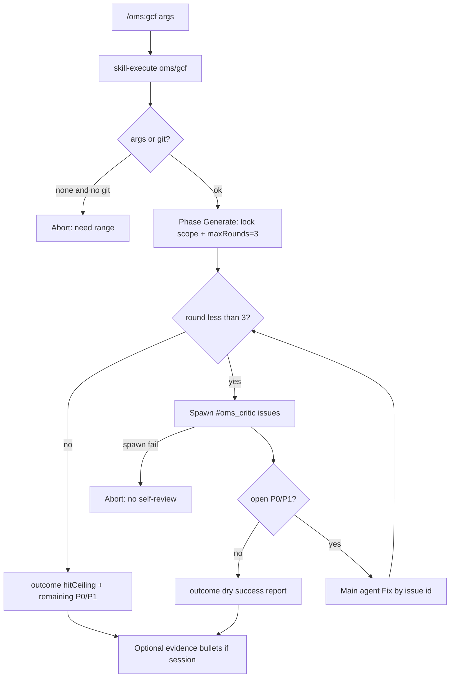

# 有界 GCF 金牌配方 - Plan

## Goal Capsule

- **Objective:** 提供独立入口 `/oms:gcf`，对**已有改动/目标范围**做有界「挑刺 → 修复」循环：独立 critic 产出可机读问题列表，Fix 逐条对账，最多 3 轮；无未修 P0/P1 即视为干；撞轮次帽时诚实失败。可选将结果写入活跃会话的完成门 evidence。
- **Authority:** 本 Product Contract > ideation Wave 4 排序与 cookbook 形状类比。完成门规则、stage 门禁、STATUS 字段模型以既有 plan（002/003/004/005）为准；本计划不修改收工裁决语义。
- **Open blockers:** 无（产品决策已在 brainstorm 钉死）。
- **Depends on (product):** Snow 可 spawn 独立子代理（如 `#oms_critic`）；现有 `skill-execute` / commands 安装路径；可选依赖活跃 OMS session + ledger（非强制）。
- **Out of MVP:** auto 默认强制 GCF、loop-until-dry、team 合并可观测、journal 审计轨、从零 Generate 全路径、完成门 L2、配方库脚手架。
- **Product Contract preservation:** Product Contract unchanged（planning 仅补 HOW；R/A/F/AE/D ID 稳定）。

---

## Product Contract

### Summary

用户通过 **`/oms:gcf [范围]`** 启动有界质量工序。  
第一版默认**不从零写功能**，而是锁定已有改动（或用户给出的路径/范围），进入 **Critique → Fix** 循环（产品名仍称 GCF 金牌配方；Generate 退化为「锁定范围 / 确认基线」）。  
挑刺必须由**独立子代理**完成，禁止主代理自审。  
退出条件：**无未修 P0/P1**，或 **达到 3 轮帽** 并诚实报告 `hitCeiling` 与剩余问题。  
有活跃 OMS 会话时，**可选**把摘要写入完成门 evidence；**不**强制会话，**不**默认卡住 done。

### Problem Frame

- **Who:** 自驾或手动改码后的用户；主 agent；独立 critic 子代理。
- **What breaks:**
  - cleanup / qa 会「转圈修」，但没有**结构化问题列表 + 轮次硬帽 + 严重度门槛**的可复现形状。
  - 完成门要求 reviewer/critic 签核，却没有把「中间质量工序」产品化成可重复命令。
  - 只靠模型口头「修干净了」会假绿；无界挑刺又会烧预算。
- **Why now:** v0.3–0.4 已解决收工门、状态可见、硬停与交接。Wave 4 首要缺口是**中间质量可复现**；GCF 是配方库样板。

### Requirements

**入口与范围**

- **R1. 独立命令** — 提供用户可调用的 `/oms:gcf`（及对应 skill 加载路径，命名在 planning 定，产品语义为 gcf）。第一版**不**把 GCF 默认焊进 `/oms:auto` 收工路径。
- **R2. 目标范围** — 用户可传范围参数（路径/目录/自然语言目标）。未传时默认「当前工作树相对基线的相关改动」（如 git diff / 未提交变更；非 git 场景在 planning 定义等价启发式，须对用户可见）。
- **R3. Generate = 锁定范围** — 第一阶段确认：审查/修复范围、基线摘要、默认刹车参数。**不要求**从空仓库生成新功能；完整「从零 Generate」为非目标。

**Critique**

- **R4. 独立挑刺** — 每轮 Critique **必须**由独立子代理执行（推荐 `#oms_critic`；可用等价只读审查身份）。主会话 agent **不得**自审并声称通过 GCF。
- **R5. 问题列表契约** — Critique 输出机读 `issues[]`，每项至少：`id`、`severity`、`severity`（P0|P1|P2|P3）、`file` + 行号或等价定位、`status`（open|fixed|deferred）。禁止只有散文、无列表。
- **R6. 严重度语义** — P0/P1 为「必须修完才算干」；P2/P3 可记入报告，不阻塞「干」判定（用户可手动要求修，但默认不强制）。

**Fix**

- **R7. 逐条对账** — Fix 阶段对照上一轮 `issues[]` 修复；每轮结束更新每条 status。禁止笼统「都修了」而无 id 对账。
- **R8. 阶段纪律** — 若存在活跃 OMS 会话且 stage 非 `executing`，改文件前须进入允许写盘的 stage（与现有 hook 一致）；无会话时按 Snow 默认工具能力执行，但须在报告中标明「无 OMS session」。

**有界退出**

- **R9. 轮次帽** — 默认 **maxRounds = 3**（一轮 = Critique + Fix）。达到上限后**不得**静默再开第 4 轮。
- **R10. 干（成功）** — 某轮 Critique 后：不存在 `status=open` 的 P0/P1（P2/P3 可仍 open）。报告 `outcome: dry`（或等价成功语义）。
- **R11. 撞帽（失败语义）** — 3 轮后仍有 open 的 P0/P1：报告 `outcome: hitCeiling`、剩余 issues、本轮摘要；**不得**声称 GCF 成功或「已修干净」。对用户呈现为需决策的失败/未完成（非假绿）。
- **R12. 预算/轮次可见** — 每轮与结束报告展示：当前轮次 / maxRounds、本轮新增/关闭 issue 计数、仍 open 的 P0/P1 数。

**与会话 / 完成门**

- **R13. 可独立运行** — 无活跃 OMS 会话时 `/oms:gcf` 仍可完整跑完并产出报告。
- **R14. 可选 evidence** — 若存在活跃会话且 `gatesRequired`（或等价完成门开启），GCF **可**将摘要（outcome、轮次、open P0/P1 计数、关键 file:line 抽样）写入后续 scorecard 的 `evidence[]` 候选说明；**不**自动 submit-gate，**不**自动放行 done。
- **R15. 不绑架收工** — 第一版 GCF 失败**不**修改完成门通过规则；用户仍可按既有门路径收工（由门本身裁决）。

**可观测与诚实**

- **R16. 终局报告最低集** — outcome、范围、轮次、issues 全量或分层摘要（至少列出全部 open P0/P1）、是否 hitCeiling、是否写入 session evidence。
- **R17. 禁止假模式** — 若无法 spawn 独立 critic，**中止**并说明原因；不得降级为主代理自审却报告 GCF 成功。

### Actors

- **A1. 用户** — 调用 `/oms:gcf`、阅读终局报告、撞帽后决定继续或收工。
- **A2. 主 agent（orchestrator）** — 锁定范围、调度循环、Fix、写报告；不自审。
- **A3. 独立 critic 子代理** — 只读挑刺，产出 `issues[]`。
- **A4. 可选 OMS 控制面** — session / stage / ledger（R14）。

### Key Flows

**F1. 独立 GCF 成功（干）**

1. 用户 `/oms:gcf [范围]`  
2. 锁定范围 → Critique(独立) → 有 P0/P1 → Fix → 再 Critique …  
3. Critique 无 open P0/P1 → 成功报告 `dry`

**F2. 撞轮次帽**

1. 同上循环满 3 轮  
2. 仍有 open P0/P1 → `hitCeiling` 报告，非成功

**F3. 有会话可选 evidence**

1. 活跃 session 下跑 F1 或 F2  
2. 终局提示可将摘要用作完成门 evidence；用户/主 agent 按既有门流程自行 submit（非 GCF 自动过门）

### Acceptance Examples

- **AE1 (R1,R2,R3)** — 给定有未提交 diff 的仓库，用户无参调用 `/oms:gcf`，Then 范围基于该 diff 可见锁定，且不要求从零实现新功能。
- **AE2 (R4,R5)** — 每轮 Critique 由非主身份子代理产出含 file:line 的 `issues[]`；主 agent 自审产出不得标为 GCF 通过。
- **AE3 (R9,R10)** — 第 1 轮 Critique 仅 P2，无 P0/P1 open，Then 可立即 `dry` 成功（不必硬跑满 3 轮）。
- **AE4 (R9,R11)** — 连续 3 轮后仍有 open P0，Then 报告 `hitCeiling` 与剩余 P0，且不得声称成功。
- **AE5 (R13)** — 无 `.snow/oms-state` 活跃会话时 GCF 仍能完成并出报告。
- **AE6 (R14,R15)** — 有会话且 GCF `hitCeiling` 时，完成门规则不变；GCF 不自动 `set-stage done`。
- **AE7 (R17)** — 无法 spawn critic 时中止并失败说明，不出现「弱模式自审成功」。

### Success Criteria

- Dogfood：对真实 diff 跑通至少一次 `dry` 与一次 `hitCeiling` 路径，报告字段齐全。
- 与 ideation 承诺一致：有界、独立挑刺、P0/P1 门槛、不绑架 auto 默认路径。
- 用户能用一句话解释：`/oms:gcf` =「对已有改动做最多 3 轮独立挑刺修复，没清掉硬伤就老实说没清掉」。

### Scope Boundaries

**In scope (MVP)**

- `/oms:gcf` + skill 工序文案与安装
- 范围锁定、独立 Critique、Fix 对账、3 轮帽、P0/P1 干判定、诚实 hitCeiling
- 可选 session evidence 说明
- README / help 一行入口说明

**Deferred**

- `/oms:auto --with gcf` 或收工前强制 GCF（ideation #7）
- 从零 Generate 全路径 / `--from-scratch`
- 可配置 maxRounds/severity 的用户旗标（默认写死 3 + P0/P1；planning 可预留扩展点但非 MVP 必交）
- journal.jsonl 事件（ideation #2）
- loop-until-dry、team 合并、分片 review
- 配方库 + fixture 回归脚手架
- 完成门 L2 真隔离

**Outside identity**

- 移植 Claude Code Dynamic Workflow / `agent()` 运行时
- 修改既有完成门通过公式（task-complete / reconcile / code-quality / completion）

### Key Decisions

| ID | 决策 | 理由 |
|----|------|------|
| D1 | 独立 `/oms:gcf`，不先改 cleanup 语义 | 新产品形状可卖、可回归；避免 cleanup 职责膨胀 |
| D2 | 默认 Critique→Fix on 已有改动 | 对齐 auto 后收口与 dogfood；从零生成延后 |
| D3 | maxRounds=3；干=无 open P0/P1 | 有界 + 避免风格问题拖死 |
| D4 | 必须独立 critic；不可降级自审 | 对齐反自签；守 GCF 精髓 |
| D5 | 可独立跑；会话 evidence 可选 | 低摩擦 dogfood；不绑架收工 |
| D6 | hitCeiling = 失败语义诚实退出 | 对齐硬停诚实叙事；禁止假绿 |

### Outstanding Questions

无阻塞项。以下留给 `ce-plan`：

- skill 目录名与 command JSON 的精确字符串
- 无 git 时默认范围启发式
- `issues[]` 落盘位置（仅报告 vs `oms-state` 临时文件）——须服务 R5/R7，不改变产品语义
- 测试策略（prompt 契约测 vs 集成夹具）

### Assumptions

- Snow 在正常安装下可 spawn `#oms_critic`（或文档标明的等价审查子代理）。
- P0–P3 由 critic 按常见工程严重度标注；MVP 不引入可配置评分模型。
- 「非零/失败语义」在 slash 场景体现为**明确失败 outcome 文案**；是否映射进程 exit code 由 planning 决定，产品上不得假绿。

### Sources

- Ideation Wave 4 #1：`docs/ideation/2026-07-09-oms-optimization-from-workflow-cookbook.html`
- 相邻命令：`assets/commands/oms/cleanup.json`、`qa.json`、`auto.json`
- workflow-cookbook 第 12 章 GCF / 附录 F 有界 Loop；第 26 章 C1/C2
- 用户 brainstorm 决策（2026-07-10）：独立入口、已有改动、3 轮+P0/P1、可选 evidence、强制独立 critic、hitCeiling 诚实失败

---

## Planning Contract

### Summary

用 **skill + slash command** 交付有界 GCF（与 cleanup 同形）：`assets/skills/oms/gcf/SKILL.md` 写死工序与退出契约；`assets/commands/oms/gcf.json` 经 `skill-execute oms/gcf` 启动。  
契约测试锁定：maxRounds=3、P0/P1 干判定、禁止自审、hitCeiling 失败语义、可选 evidence 文案。  
**不**新增 MCP 工具；**不**改完成门 / auto 默认路径。Installer 已按目录拷贝，doctor 阈值 `>=10` / `>=18` 兼容 +1 skill/+1 command。

### Key Technical Decisions

| ID | Decision | Rationale |
|----|----------|-----------|
| KTD1 | 产品形状 = skill `oms/gcf` + command `/oms:gcf`，无新 MCP | 对齐 cleanup；工序是 agent 行为契约，非控制面状态机；MVP 最快可 dogfood |
| KTD2 | skill 名 `gcf`；frontmatter 仅 name+description | OMS-DESIGN-CONSTRAINTS |
| KTD3 | 默认范围：用户 `$ARGUMENTS` 非空用其；否则 `git status --porcelain` + `git diff`（含 staged）；非 git 则要求用户给路径否则中止 | R2/R3；避免瞎扫全仓 |
| KTD4 | 一轮 = 独立 `#oms_critic` Critique + 主代理 Fix；默认 maxRounds=3 | R4/R9 |
| KTD5 | `issues[]` 字段：`id,severity,severity,file,line?,status`；severity ∈ P0–P3；status ∈ open\|fixed\|deferred | R5/R6/R7 |
| KTD6 | 干：无 open 的 P0/P1；P2/P3 可残留 | R6/R10 |
| KTD7 | hitCeiling：满 3 轮仍有 open P0/P1 → outcome 失败，禁止「成功」措辞 | R11 |
| KTD8 | 无法 spawn critic → 立即中止失败（不降级自审） | R17 |
| KTD9 | 有活跃 state 时：Fix 前若 stage 非 executing 则 `oms-set-stage executing`；无 session 则跳过 OMS 工具 | R8/R13 |
| KTD10 | 可选 evidence：终局列出可粘贴进 scorecard 的 3–8 条 evidence 句；**不**调用 submit-gate | R14/R15 |
| KTD11 | 契约测：静态扫 SKILL.md / gcf.json / help / README；不 mock 子代理运行时 | prompt 产品可测性与 maturity 合同一致 |
| KTD12 | 不改 doctor 阈值数字（`>=` 已松）；README 技能/命令计数 +1 | installer 扫目录 |

### High-Level Technical Design

### Assumptions (planning)

- Snow 在已 setup 环境可 spawn `#oms_critic`；契约测不验证运行时 spawn。
- 「失败语义」= 报告 `outcome: hitCeiling|aborted` + 明确未成功措辞；slash 无进程 exit code 要求。
- issues 默认只在对话报告中维护；可选写入 `.snow/oms-state/specs/gcf-<slug>.md` 若实现方便，**非** MVP 必交。

### Implementation Units

### U1. GCF skill 工序正文

- **Goal:** 可被 `skill-execute` 加载的完整有界 GCF 规程（锁定范围 → Critique/Fix 循环 → 干/撞帽报告）。
- **Requirements:** R2–R12, R16–R17, F1–F2, AE1–AE4, AE7, D2–D4, D6
- **Dependencies:** 无
- **Files:**
  - create: `assets/skills/oms/gcf/SKILL.md`
  - test: `test/test-gcf-recipe.mjs`
- **Approach:**
  - 标准章节：When to Use / When NOT / Why / Procedure / Execution Policy / Anti-Patterns / Quick Reference。
  - Procedure：Step0 范围；Step1 循环（spawn critic → 解析 issues → 干判定 → Fix 对账）；Step2 终局报告模板（outcome、round、open P0/P1、hitCeiling）。
  - 硬编码 maxRounds=3；干=无 open P0/P1；禁止主代理自审；spawn 失败中止。
  - When NOT：从零写功能 → plan/auto；只修编译红 → qa；无界扫雷 → 未来 dry。
- **Patterns to follow:** `assets/skills/oms/cleanup/SKILL.md` 结构；interview 的 maxRounds 表述风格。
- **Test scenarios:**
  - SKILL 含 `maxRounds`/`3`、P0/P1、hitCeiling、`#oms_critic`、禁止自审字样。
  - 含 issues 字段名（id/severity/severity/status）。
  - 不含「主代理可自审通过」。
- **Verification:** `node test/test-gcf-recipe.mjs` 相关断言绿。

### U2. `/oms:gcf` 命令入口

- **Goal:** 用户 slash 入口与 cleanup 同形。
- **Requirements:** R1, AE1
- **Dependencies:** U1
- **Files:**
  - create: `assets/commands/oms/gcf.json`
  - test: `test/test-gcf-recipe.mjs`
- **Approach:**
  - `skill-execute` `{ "skill": "oms/gcf" }` + `$ARGUMENTS` 作为范围。
  - description/argsHint 中文说明「有界挑刺修复，默认针对已有改动」。
- **Patterns to follow:** `assets/commands/oms/cleanup.json`。
- **Test scenarios:**
  - JSON 可 parse；name `oms:gcf`；command 含 `oms/gcf`。
- **Verification:** 契约测 + 文件存在。

### U3. 会话可选衔接与 evidence 文案

- **Goal:** skill 内写清无/有 session 行为；可选 evidence 列表；不自动过门。
- **Requirements:** R8, R13–R15, F3, AE5–AE6
- **Dependencies:** U1
- **Files:**
  - modify: `assets/skills/oms/gcf/SKILL.md`（同一文件增补）
  - test: `test/test-gcf-recipe.mjs`
- **Approach:**
  - 有 state：`oms-get-state`；非 executing 则 set executing 再 Fix。
  - 无 state：跳过 OMS MCP，报告标注 no-session。
  - 终局「Evidence candidates」小节；明确禁止 `submit-gate` / `set-stage done` 由 GCF 代劳。
- **Test scenarios:**
  - 文案含可选 evidence 与「不自动 submit-gate/done」。
  - 含 no-session 可运行说明。
- **Verification:** 契约测。

### U4. 文档、help、计数与全量回归

- **Goal:** 可发现性；README/help 计数与列表正确；npm test 绿。
- **Requirements:** Success Criteria, R1
- **Dependencies:** U1–U3
- **Files:**
  - modify: `README.md`（Features / commands / skills 表与「10 skills / 19 commands」→ +1）
  - modify: `assets/commands/oms/help.json`（增加 gcf 条目；计数同步）
  - modify: `CHANGELOG.md`（Unreleased 或下一版本条目）
  - create: `test/test-gcf-recipe.mjs`
  - modify: `package.json` scripts.test 串联新测试
- **Approach:**
  - help 保持「原样展示」长文结构，插入 GCF 一小节。
  - doctor 阈值无需改（`>=`）。
- **Test scenarios:**
  - README 或 help 含 `/oms:gcf`。
  - package.json test 含 `test-gcf-recipe`。
  - `npm test` 全绿。
- **Verification:** `npm test`。

---

## Verification Contract

| Gate | Proof |
|------|--------|
| 契约 | `test/test-gcf-recipe.mjs`：skill/command 硬规则字符串与结构 |
| 安装兼容 | doctor `skills>=10`、`commands>=18` 在 +1 后仍真；setup 拷贝新目录 |
| 回归 | 现有 hooks/mcp/gates/handoff 测试不改语义且全绿 |
| 产品映射 | AE1–AE7 由 skill 文案 + 契约测覆盖可检查部分；运行时 spawn 靠 dogfood |

## Definition of Done

- [ ] `assets/skills/oms/gcf/SKILL.md` 完整工序与反模式
- [ ] `assets/commands/oms/gcf.json` 可安装入口
- [ ] maxRounds=3、P0/P1 干、独立 critic、hitCeiling、禁自审 均写死且契约测锁定
- [ ] 无 session 可跑、有 session 可选 evidence、不自动过门 写清
- [ ] README + help + CHANGELOG 更新
- [ ] `npm test` 全绿
- [ ] 不修改完成门规则与 auto 默认路径

## Risks & Dependencies

| Risk | Mitigation |
|------|------------|
| 纯 prompt 工序 agent 不遵守 | 契约测锁文案；Anti-Patterns 醒目；后续 dogfood 再加 journal |
| critic 输出非 JSON | skill 要求 JSON 块；解析失败算本轮无效并重试一次，仍失败记 open 技术债 issue |
| 范围过大烧 token | 默认 git diff；无范围中止；When NOT 指向 plan/auto |
| help.json 超长难 diff | 只插入小节；保持原样展示契约 |

### Deferred to Follow-Up Work

- `/oms:auto --with gcf` 嵌套（ideation #7）
- journal 事件、loop-until-dry、team 合并可观测
- 可配置 maxRounds/severity 旗标
- issues 落盘 + fixture 回归脚手架
